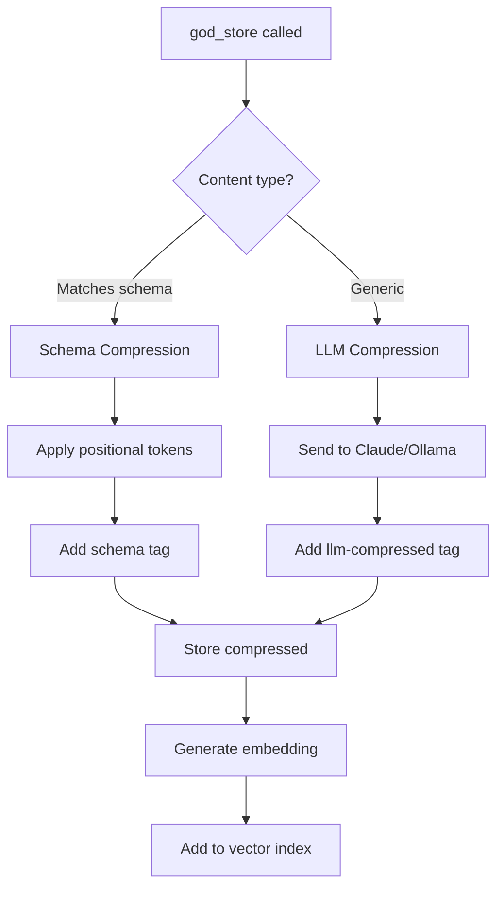
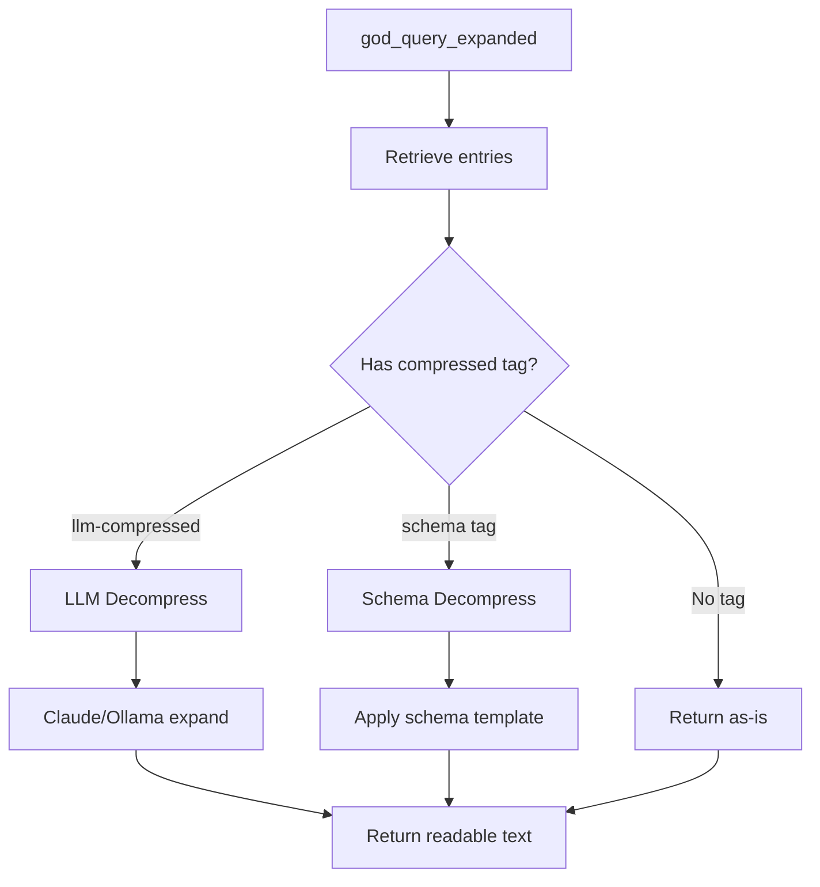
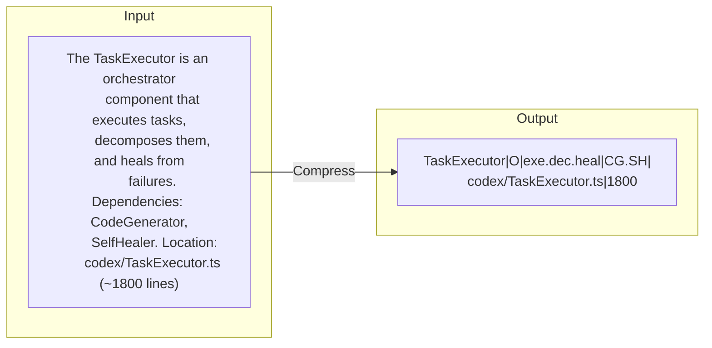
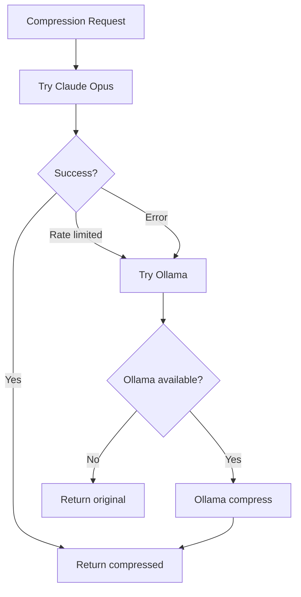

# Compression Flow

How content is compressed and decompressed.

## Compression Pipeline



## Decompression Pipeline



## Schema Selection

```mermaid
flowchart TD
    A[Content] --> B{Detect type}

    B -->|Component info| C[COMPONENT schema]
    B -->|Error details| D[ERROR_PATTERN schema]
    B -->|Bug fix record| E[BUG_FIX schema]
    B -->|Architecture| F[ARCH_INSIGHT schema]
    B -->|Unknown| G[GENERIC/LLM]

    C --> H[name|type|actions|deps|path|lines]
    D --> I[id|symptom|root|fix|file]
    E --> J[id|status|symptom|root|fix|file|lesson]
    F --> K[name|type|insight|pattern|rule|comps]
    G --> L[LLM compression]
```

## 18 Compression Schemas

| Schema | Format | Use Case |
|--------|--------|----------|
| COMPONENT | `name\|type\|actions\|deps\|path\|lines` | Source components |
| DEPARTMENT | `name\|role\|actions\|agents\|phase\|path` | RUBIX departments |
| MCP_TOOL | `name\|action\|params\|returns\|uses` | Tool definitions |
| CAPABILITY | `name\|actions\|langs\|apis\|path` | IDE capabilities |
| WORKFLOW | `name\|steps\|actors\|budget` | Process flows |
| CONFIG | `name\|vars\|defaults` | Configuration |
| ERROR_PATTERN | `id\|symptom\|root\|fix\|file` | Error patterns |
| SUCCESS_PATTERN | `name\|factors\|rate\|context` | Success patterns |
| SYSTEM | `name\|modes\|core\|storage\|embed` | System info |
| BUG_FIX | `id\|status\|symptom\|root\|fix\|file\|lesson` | Bug records |
| DEV_FEATURE | `name\|type\|purpose\|path\|exports\|wiring` | Features |
| ARCH_INSIGHT | `name\|type\|insight\|pattern\|rule\|comps` | Architecture |
| CONVERSATION | `task_id\|department\|attempt\|...` | Conversations |
| CONTEXT_BUNDLE | `CTX\|task_id\|desc\|files\|...` | Task context |
| DESIGN | `DES\|comps\|models\|files\|apis\|notes` | Designs |
| EXEC_PLAN | `PLAN\|dept\|ops\|cmd\|conf\|notes` | Execution plans |
| VALIDATION | `VAL\|approve\|tests\|sec\|perf\|...` | Validation |
| GENERIC | Filler word removal | Fallback |

## Compression Example



## Provider Fallback



## Metrics

| Content Type | Typical Reduction |
|--------------|-------------------|
| Component docs | 70% |
| Error patterns | 69% |
| Architecture | 65% |
| Generic text | 30% |

## Related

- [Memory Flow](memory-flow.md)
- [Compression Schemas](../memory/compression-schemas.md)
- [Compression Prompt](../prompts/compression-prompt.md)
