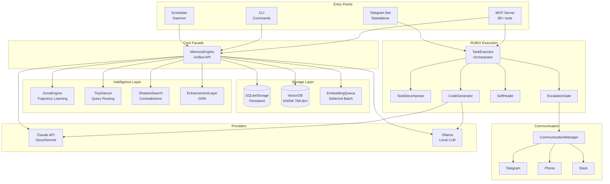
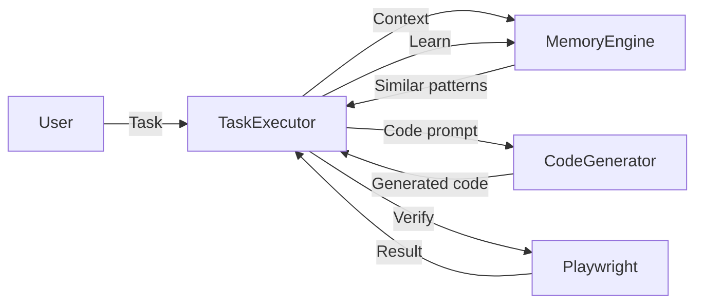

# System Architecture

High-level architecture of the RUBIX/god-agent system.

## Complete System Diagram

## Layer Breakdown

### Entry Points
| Component | Purpose |
|-----------|---------|
| MCP Server | Model Context Protocol interface (80+ tools) |
| CLI | Command-line interface |
| Telegram Bot | Standalone chat interface |
| Scheduler | Background cron/event daemon |

### Storage Layer
| Component | Purpose |
|-----------|---------|
| SQLiteStorage | Persistent memory entries |
| VectorDB (HNSW) | 768-dimensional semantic search |
| EmbeddingQueue | Batched embedding generation |

### Intelligence Layer
| Component | Purpose |
|-----------|---------|
| SonaEngine | Trajectory-based learning |
| TinyDancer | Query routing with circuit breakers |
| ShadowSearch | Contradiction finding |
| EnhancementLayer | GNN-based embedding enrichment |

### RUBIX Execution
| Component | Purpose |
|-----------|---------|
| TaskExecutor | Main orchestrator |
| TaskDecomposer | Task → subtask breakdown |
| CodeGenerator | Claude-powered code generation |
| SelfHealer | Failure analysis and recovery |
| EscalationGate | Human escalation decisions |

## Data Flow Summary

## Related

- [Task Execution Flow](task-execution-flow.md)
- [Memory Flow](memory-flow.md)
- [Learning Flow](learning-flow.md)
