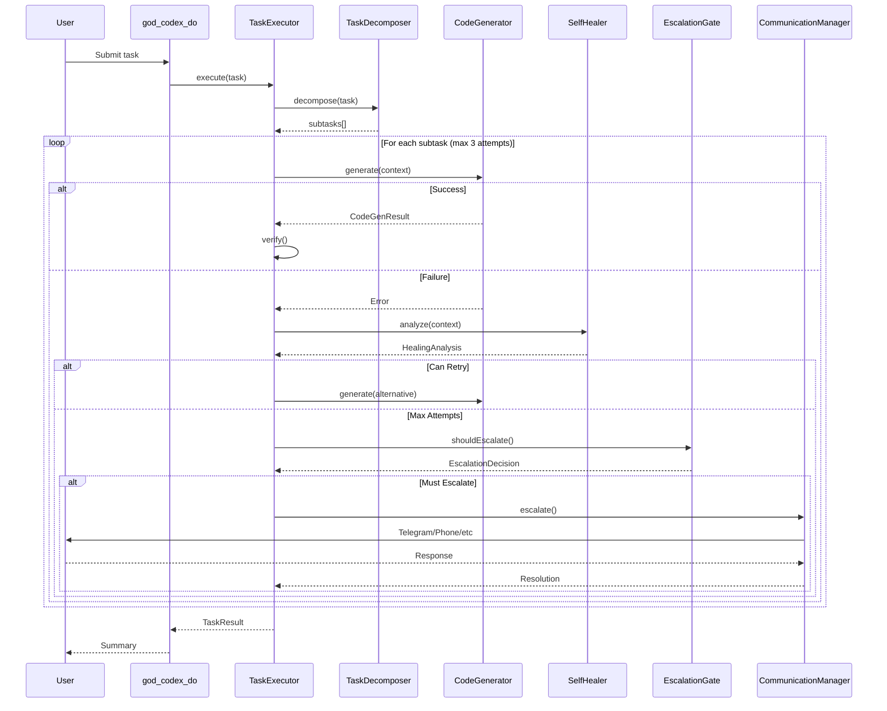
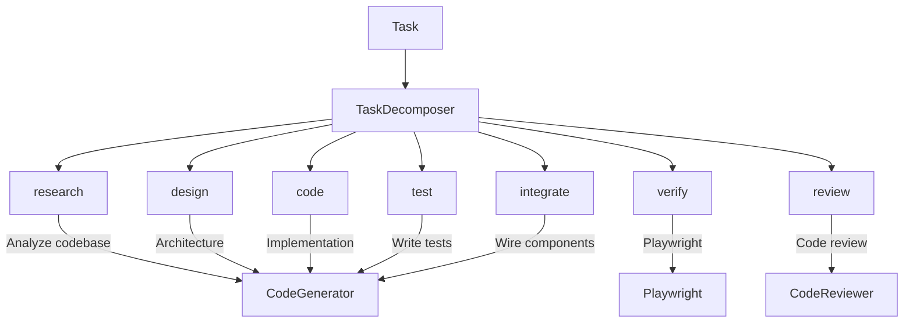
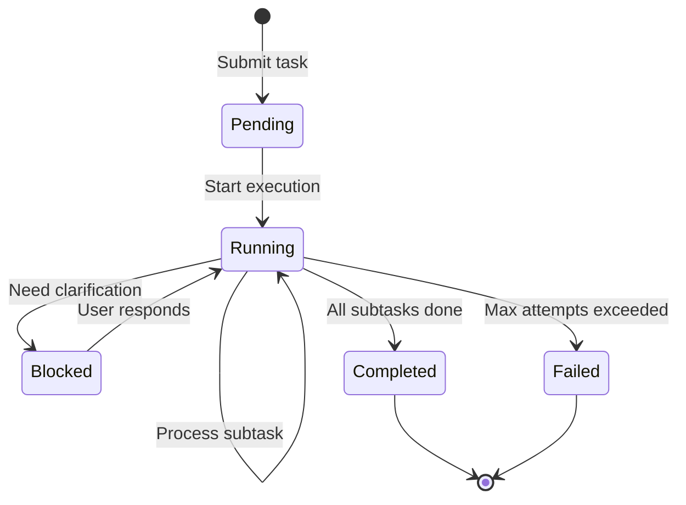

# Task Execution Flow

How RUBIX executes tasks from submission to completion.

## Sequence Diagram

## Subtask Types

## Retry Strategy

| Attempt | Strategy | Thinking Budget |
|---------|----------|-----------------|
| 1 | Standard approach | 0 (no thinking) |
| 2 | Alternative + healing suggestions | 5,000 tokens |
| 3 | Ultrathink mode | 16,000 tokens |
| 4+ | Escalate to human | N/A |

## State Machine

## Related

- [System Architecture](system-architecture.md)
- [Escalation Flow](escalation-flow.md)
- [CODEX Tools](../tools/codex-tools.md)
