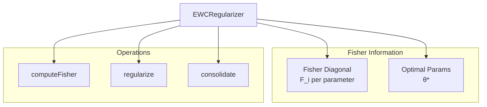

# EWCRegularizer

**File:** `src/learning/EWCRegularizer.ts` (~150 lines)

The EWCRegularizer implements Elastic Weight Consolidation (EWC++) to prevent catastrophic forgetting during continuous learning.

## Overview



## What is EWC++?

EWC++ is an improved version of Elastic Weight Consolidation that:

1. **Prevents Catastrophic Forgetting**: Keeps important knowledge from previous tasks
2. **Uses Fisher Information**: Identifies which parameters are most important
3. **Online Updates**: Can update importance continuously without storing old data

### The Math

```
Loss_total = Loss_task + λ × Σ F_i × (θ_i - θ*_i)²

Where:
- Loss_task: Current task loss (gradient from feedback)
- λ: Regularization strength
- F_i: Fisher information for parameter i (importance)
- θ_i: Current parameter value
- θ*_i: Previous optimal parameter value
```

## Class Structure

```typescript
class EWCRegularizer {
  private fisherDiagonal: Map<string, number>;
  private optimalParams: Map<string, number>;
  private lambda: number;
  private decay: number;

  constructor(config?: EWCConfig) {
    this.fisherDiagonal = new Map();
    this.optimalParams = new Map();
    this.lambda = config?.lambda ?? 0.5;
    this.decay = config?.decay ?? 0.99;
  }
}
```

## Configuration

```typescript
interface EWCConfig {
  lambda?: number;    // Regularization strength (default: 0.5)
  decay?: number;     // Fisher decay for online updates (default: 0.99)
  minFisher?: number; // Minimum Fisher value (default: 0.01)
}
```

## Core Methods

### regularize()

Apply EWC regularization to a gradient:

```typescript
regularize(
  gradient: number,
  patternId: string,
  currentWeight: number
): number {
  // Get Fisher information for this parameter
  const fisher = this.fisherDiagonal.get(patternId) ?? 0;

  // Get optimal parameter from last consolidation
  const optimal = this.optimalParams.get(patternId) ?? currentWeight;

  // Calculate regularization penalty
  // penalty = λ × F × (θ - θ*)
  const penalty = this.lambda * fisher * (currentWeight - optimal);

  // Regularized gradient = original gradient - penalty
  return gradient - penalty;
}
```

### computeFisher()

Compute Fisher information from gradients:

```typescript
computeFisher(
  patternId: string,
  gradient: number
): void {
  // Fisher information approximated by squared gradient
  const newFisher = gradient * gradient;

  // Online update with decay (EWC++)
  const oldFisher = this.fisherDiagonal.get(patternId) ?? 0;
  const updatedFisher = this.decay * oldFisher + (1 - this.decay) * newFisher;

  this.fisherDiagonal.set(patternId, updatedFisher);
}
```

### consolidate()

Store current parameters as optimal for future regularization:

```typescript
consolidate(weights: Map<string, number>): void {
  for (const [patternId, weight] of weights) {
    this.optimalParams.set(patternId, weight);
  }
}
```

## EWC++ Flow

```mermaid
flowchart TD
    A[Receive gradient] --> B[Get Fisher F_i]
    B --> C[Get optimal θ*]
    C --> D[Calculate penalty<br/>λ × F × (θ - θ*)]
    D --> E[Regularized gradient<br/>g - penalty]
    E --> F[Apply to weight]

    F --> G[Update Fisher<br/>F_new = decay × F_old + (1-decay) × g²]

    G --> H{Task boundary?}
    H -->|Yes| I[Consolidate<br/>θ* = θ_current]
    H -->|No| J[Continue]
```

## Online Fisher Updates

Traditional EWC requires recomputing Fisher over the entire dataset. EWC++ uses online updates:

```typescript
// Online Fisher update formula
F_new = decay × F_old + (1 - decay) × gradient²

// With decay = 0.99:
// - Recent gradients have more influence
// - Old information slowly fades
// - No need to store historical data
```

## Importance Tracking

### getImportance()

```typescript
getImportance(patternId: string): number {
  return this.fisherDiagonal.get(patternId) ?? 0;
}
```

### getMostImportant()

```typescript
getMostImportant(limit: number = 10): PatternImportance[] {
  const entries = Array.from(this.fisherDiagonal.entries());

  return entries
    .map(([id, fisher]) => ({ patternId: id, importance: fisher }))
    .sort((a, b) => b.importance - a.importance)
    .slice(0, limit);
}
```

## Selective Consolidation

Only consolidate patterns above importance threshold:

```typescript
consolidateImportant(
  weights: Map<string, number>,
  threshold: number = 0.1
): number {
  let consolidated = 0;

  for (const [patternId, weight] of weights) {
    const importance = this.fisherDiagonal.get(patternId) ?? 0;

    if (importance >= threshold) {
      this.optimalParams.set(patternId, weight);
      consolidated++;
    }
  }

  return consolidated;
}
```

## Reset and Clear

### reset()

```typescript
reset(): void {
  this.fisherDiagonal.clear();
  this.optimalParams.clear();
}
```

### clearPattern()

```typescript
clearPattern(patternId: string): void {
  this.fisherDiagonal.delete(patternId);
  this.optimalParams.delete(patternId);
}
```

## Statistics

### getStats()

```typescript
interface EWCStats {
  totalPatterns: number;
  avgFisher: number;
  maxFisher: number;
  consolidatedPatterns: number;
}

getStats(): EWCStats {
  const fishers = Array.from(this.fisherDiagonal.values());

  return {
    totalPatterns: this.fisherDiagonal.size,
    avgFisher: fishers.length > 0
      ? fishers.reduce((a, b) => a + b, 0) / fishers.length
      : 0,
    maxFisher: fishers.length > 0 ? Math.max(...fishers) : 0,
    consolidatedPatterns: this.optimalParams.size
  };
}
```

## Persistence

### save()

```typescript
async save(storage: SQLiteStorage): Promise<void> {
  // Save Fisher diagonal
  for (const [id, fisher] of this.fisherDiagonal) {
    await storage.run(`
      INSERT OR REPLACE INTO ewc_fisher (pattern_id, fisher)
      VALUES (?, ?)
    `, [id, fisher]);
  }

  // Save optimal params
  for (const [id, optimal] of this.optimalParams) {
    await storage.run(`
      INSERT OR REPLACE INTO ewc_optimal (pattern_id, optimal)
      VALUES (?, ?)
    `, [id, optimal]);
  }
}
```

### load()

```typescript
async load(storage: SQLiteStorage): Promise<void> {
  // Load Fisher diagonal
  const fisherRows = await storage.all(`
    SELECT pattern_id, fisher FROM ewc_fisher
  `);

  for (const row of fisherRows) {
    this.fisherDiagonal.set(row.pattern_id, row.fisher);
  }

  // Load optimal params
  const optimalRows = await storage.all(`
    SELECT pattern_id, optimal FROM ewc_optimal
  `);

  for (const row of optimalRows) {
    this.optimalParams.set(row.pattern_id, row.optimal);
  }
}
```

## Usage Example

```typescript
const ewc = new EWCRegularizer({
  lambda: 0.5,     // Moderate regularization
  decay: 0.99      // Slow decay of old Fisher info
});

// During training
for (const feedback of feedbacks) {
  const gradient = calculateGradient(feedback.quality);

  // Regularize gradient
  const regularizedGradient = ewc.regularize(
    gradient,
    feedback.patternId,
    currentWeight
  );

  // Apply regularized gradient
  currentWeight += regularizedGradient;

  // Update Fisher information
  ewc.computeFisher(feedback.patternId, gradient);
}

// At task boundary (e.g., daily)
ewc.consolidate(allCurrentWeights);

// Check most important patterns
const important = ewc.getMostImportant(10);
console.log('Most important patterns:', important);
```

## Integration with SonaEngine

```typescript
class SonaEngine {
  private ewcRegularizer: EWCRegularizer;

  async provideFeedback(trajectoryId: string, quality: number) {
    const gradient = this.calculateGradient(quality);

    // Apply EWC regularization
    const regularized = this.ewcRegularizer.regularize(
      gradient,
      pattern.id,
      currentWeight
    );

    // Update weight with regularized gradient
    await this.weightManager.applyGradient(pattern.id, regularized);

    // Update Fisher information
    this.ewcRegularizer.computeFisher(pattern.id, gradient);
  }

  // Periodic consolidation
  async consolidate() {
    const weights = await this.weightManager.getAllWeights();
    this.ewcRegularizer.consolidate(weights);
  }
}
```

## Why EWC++ Matters

Without regularization:
```
Task 1: Learn pattern A → weight = 0.9
Task 2: Learn pattern B → weight for A drops to 0.3 (catastrophic forgetting!)
```

With EWC++:
```
Task 1: Learn pattern A → weight = 0.9, Fisher(A) = 0.8 (important!)
Task 2: Learn pattern B → weight for A stays ~0.85 (protected by Fisher)
```

## Configuration Guidelines

| Scenario | Lambda | Decay | Effect |
|----------|--------|-------|--------|
| Stable patterns | 0.7 | 0.99 | Strong protection |
| Evolving patterns | 0.3 | 0.95 | More adaptation |
| Balanced | 0.5 | 0.99 | Default behavior |

## Next Steps

- [WeightManager](weight-manager.md) - Weight storage
- [SonaEngine](sona-engine.md) - Main learning engine
- [Learning System](index.md) - System overview
