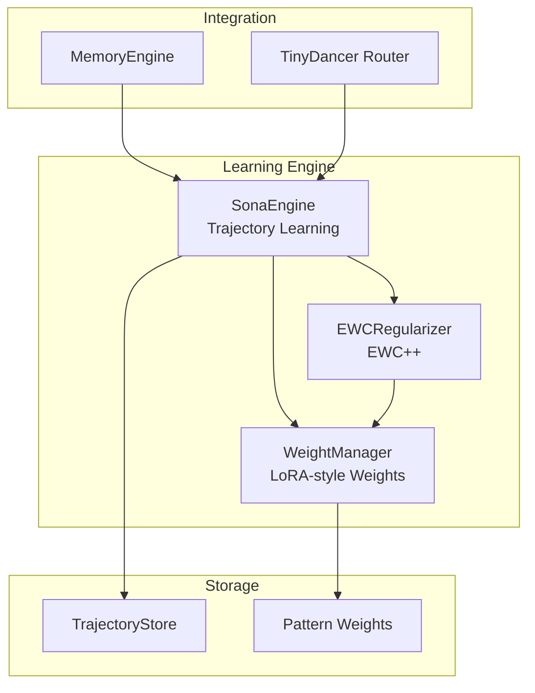
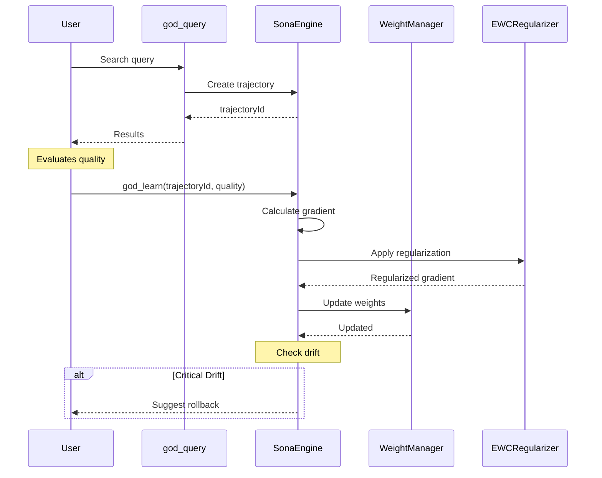
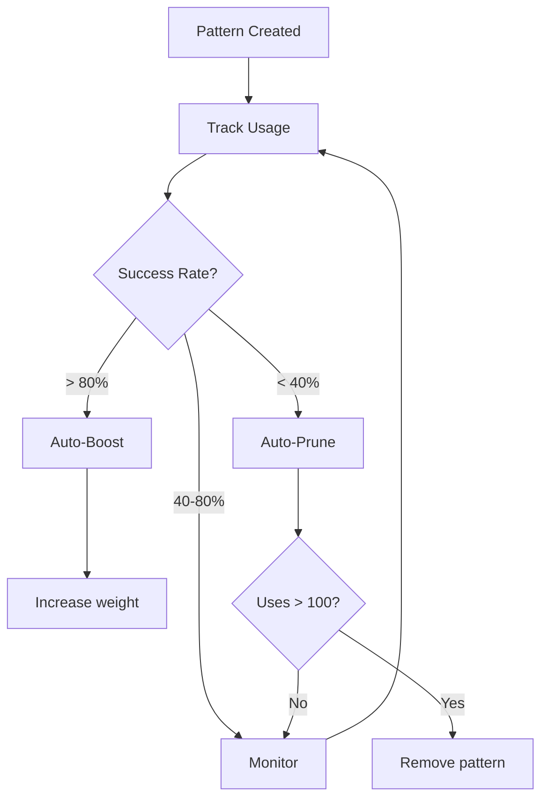
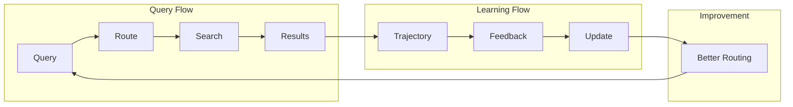

# Learning System Documentation

The learning system provides continuous improvement through trajectory-based learning with EWC++ regularization.

## Overview



## File Reference

| File | Lines | Purpose |
|------|-------|---------|
| [SonaEngine](sona-engine.md) | ~250 | Main learning orchestrator |
| [WeightManager](weight-manager.md) | ~200 | LoRA-style weight management |
| [EWCRegularizer](ewc-regularizer.md) | ~150 | EWC++ regularization |
| TrajectoryStore.ts | ~150 | Trajectory persistence |

## Learning Flow



## Key Concepts

### Trajectories

A trajectory captures the complete path from query to results:

```typescript
interface Trajectory {
  id: string;
  query: string;
  route: RouteType;
  matches: MatchInfo[];
  scores: number[];
  quality?: number;       // User feedback 0-1
  createdAt: number;
  feedbackAt?: number;
}
```

### LoRA-style Weights

Efficient weight updates that don't modify base weights:

```
final_weight = base_weight + delta_weight × scaling_factor

- Base weights: Frozen initial state
- Delta weights: Learned adjustments
- Scaling factor: Controls adaptation rate
```

### EWC++ Regularization

Prevents catastrophic forgetting of important patterns:

```
loss = task_loss + λ × Σ F_i × (θ_i - θ*_i)²

- F_i: Fisher information (importance)
- θ_i: Current parameter
- θ*_i: Previous optimal parameter
- λ: Regularization strength
```

## Pattern Evolution



## Feedback Cycle

1. **Query Executed**: User runs a search query
2. **Trajectory Created**: System records query + matches + scores
3. **User Feedback**: Quality score provided (0.0 to 1.0)
4. **Gradient Calculation**: Positive/negative based on quality
5. **EWC Regularization**: Prevents forgetting important patterns
6. **Weight Update**: Patterns adjusted based on feedback
7. **Drift Monitoring**: System watches for instability

## Quality Scores

| Score | Meaning | Effect |
|-------|---------|--------|
| 0.0 | Completely useless | Strong negative gradient |
| 0.25 | Mostly unhelpful | Moderate negative gradient |
| 0.5 | Neutral | No change |
| 0.75 | Mostly helpful | Moderate positive gradient |
| 1.0 | Perfect results | Strong positive gradient |

## Statistics Tracked

### Pattern Metrics
- Total uses
- Success count (quality > 0.5)
- Success rate
- Average quality
- Last used timestamp

### System Metrics
- Total trajectories
- Trajectories with feedback
- Current drift score
- Prune candidates
- Boost candidates

## MCP Tools

### god_learn

Provide feedback for a query trajectory:

```typescript
await mcp__rubix__god_learn({
  trajectoryId: "traj_abc123",
  quality: 0.8  // 0.0 to 1.0
});
```

### god_learning_stats

Get learning system statistics:

```typescript
const stats = await mcp__rubix__god_learning_stats();
// Returns: trajectories, patterns, drift, candidates
```

### god_prune_patterns

Prune low-performing patterns:

```typescript
await mcp__rubix__god_prune_patterns({
  dryRun: true  // Preview what would be pruned
});
```

## Configuration

| Option | Default | Description |
|--------|---------|-------------|
| `learningRate` | `0.01` | Weight update rate |
| `ewcLambda` | `0.5` | Regularization strength |
| `pruneThreshold` | `0.4` | Min success rate |
| `pruneMinUses` | `100` | Min uses before prune |
| `boostThreshold` | `0.8` | Success rate for boost |
| `driftThreshold` | `0.3` | Critical drift level |

## Architecture Integration



## Next Steps

- [SonaEngine](sona-engine.md) - Main learning orchestrator
- [WeightManager](weight-manager.md) - Weight management
- [EWCRegularizer](ewc-regularizer.md) - Regularization details
- [Routing System](../architecture/routing-system.md) - TinyDancer integration
