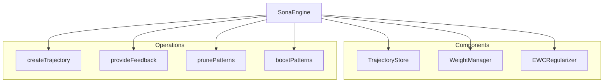

# SonaEngine

**File:** `src/learning/SonaEngine.ts` (~250 lines)

The SonaEngine is the main orchestrator for trajectory-based continuous learning.

## Overview



## Class Structure

```typescript
class SonaEngine {
  private trajectoryStore: TrajectoryStore;
  private weightManager: WeightManager;
  private ewcRegularizer: EWCRegularizer;
  private config: SonaConfig;
  private stats: LearningStats;

  constructor(options: SonaEngineOptions) {
    this.trajectoryStore = new TrajectoryStore(options.storage);
    this.weightManager = new WeightManager(options.storage);
    this.ewcRegularizer = new EWCRegularizer(options.ewcConfig);
    this.config = options.config ?? defaultConfig;
    this.stats = initializeStats();
  }
}
```

## Constructor Options

```typescript
interface SonaEngineOptions {
  storage: SQLiteStorage;
  config?: SonaConfig;
  ewcConfig?: EWCConfig;
}

interface SonaConfig {
  learningRate: number;      // Default: 0.01
  pruneThreshold: number;    // Default: 0.4
  pruneMinUses: number;      // Default: 100
  boostThreshold: number;    // Default: 0.8
  driftThreshold: number;    // Default: 0.3
}
```

## Trajectory Management

### createTrajectory()

```typescript
interface TrajectoryInput {
  query: string;
  route: RouteType;
  matches: MatchInfo[];
  scores: number[];
}

interface Trajectory {
  id: string;
  query: string;
  route: RouteType;
  matches: MatchInfo[];
  scores: number[];
  quality?: number;
  createdAt: number;
  feedbackAt?: number;
}

async createTrajectory(input: TrajectoryInput): Promise<string> {
  const trajectory: Trajectory = {
    id: generateId('traj'),
    query: input.query,
    route: input.route,
    matches: input.matches,
    scores: input.scores,
    createdAt: Date.now()
  };

  await this.trajectoryStore.store(trajectory);
  this.stats.totalTrajectories++;

  return trajectory.id;
}
```

### getTrajectory()

```typescript
async getTrajectory(trajectoryId: string): Promise<Trajectory | null> {
  return this.trajectoryStore.get(trajectoryId);
}
```

## Feedback Processing

### provideFeedback()

```typescript
interface FeedbackResult {
  trajectoryId: string;
  quality: number;
  patternsUpdated: number;
  driftScore: number;
  suggestion?: string;
}

async provideFeedback(
  trajectoryId: string,
  quality: number,
  route?: RouteType
): Promise<FeedbackResult> {
  // Validate quality
  if (quality < 0 || quality > 1) {
    throw new Error('Quality must be between 0 and 1');
  }

  // Get trajectory
  const trajectory = await this.trajectoryStore.get(trajectoryId);
  if (!trajectory) {
    throw new Error(`Trajectory not found: ${trajectoryId}`);
  }

  // Update trajectory with feedback
  trajectory.quality = quality;
  trajectory.feedbackAt = Date.now();
  await this.trajectoryStore.update(trajectory);

  // Calculate gradient direction
  const gradient = this.calculateGradient(quality);

  // Apply EWC regularization
  const regularizedGradient = await this.ewcRegularizer.regularize(
    gradient,
    trajectory.route
  );

  // Update pattern weights
  const patternsUpdated = await this.updatePatternWeights(
    trajectory,
    regularizedGradient
  );

  // Check drift
  const driftScore = await this.calculateDrift();

  // Update stats
  this.stats.trajectoriesWithFeedback++;

  return {
    trajectoryId,
    quality,
    patternsUpdated,
    driftScore,
    suggestion: this.getDriftSuggestion(driftScore)
  };
}
```

### calculateGradient()

```typescript
private calculateGradient(quality: number): number {
  // Quality 0.5 = neutral (no change)
  // Quality > 0.5 = positive gradient (strengthen)
  // Quality < 0.5 = negative gradient (weaken)
  return (quality - 0.5) * 2 * this.config.learningRate;
}
```

### updatePatternWeights()

```typescript
private async updatePatternWeights(
  trajectory: Trajectory,
  gradient: number
): Promise<number> {
  let updated = 0;

  // Extract patterns from matches
  const patterns = this.extractPatterns(trajectory);

  for (const pattern of patterns) {
    // Get current weight
    const currentWeight = await this.weightManager.getWeight(pattern.id);

    // Apply gradient
    const newWeight = Math.max(0, Math.min(1, currentWeight + gradient));

    // Update weight
    await this.weightManager.setWeight(pattern.id, newWeight);

    // Update pattern stats
    await this.updatePatternStats(pattern.id, trajectory.quality!);

    updated++;
  }

  return updated;
}
```

## Drift Monitoring

### calculateDrift()

```typescript
async calculateDrift(): Promise<number> {
  // Get recent weight changes
  const recentChanges = await this.weightManager.getRecentChanges(100);

  if (recentChanges.length === 0) {
    return 0;
  }

  // Calculate variance of changes
  const mean = recentChanges.reduce((a, b) => a + b, 0) / recentChanges.length;
  const variance = recentChanges.reduce((sum, val) =>
    sum + Math.pow(val - mean, 2), 0
  ) / recentChanges.length;

  // Normalize to 0-1 scale
  return Math.min(1, Math.sqrt(variance) * 2);
}
```

### getDriftSuggestion()

```typescript
private getDriftSuggestion(driftScore: number): string | undefined {
  if (driftScore >= this.config.driftThreshold) {
    return 'Critical drift detected. Consider rolling back recent changes.';
  }

  if (driftScore >= this.config.driftThreshold * 0.7) {
    return 'Moderate drift detected. Monitor closely.';
  }

  return undefined;
}
```

## Pattern Pruning

### prunePatterns()

```typescript
interface PruneResult {
  pruned: PatternInfo[];
  total: number;
}

async prunePatterns(dryRun: boolean = false): Promise<PruneResult> {
  const candidates = await this.getPruneCandidates();

  if (dryRun) {
    return {
      pruned: candidates,
      total: candidates.length
    };
  }

  // Actually prune
  for (const pattern of candidates) {
    await this.weightManager.removePattern(pattern.id);
  }

  return {
    pruned: candidates,
    total: candidates.length
  };
}

private async getPruneCandidates(): Promise<PatternInfo[]> {
  const allPatterns = await this.weightManager.getAllPatterns();

  return allPatterns.filter(pattern =>
    pattern.uses >= this.config.pruneMinUses &&
    pattern.successRate < this.config.pruneThreshold
  );
}
```

## Pattern Boosting

### boostPatterns()

```typescript
interface BoostResult {
  boosted: PatternInfo[];
  total: number;
}

async boostPatterns(): Promise<BoostResult> {
  const candidates = await this.getBoostCandidates();

  for (const pattern of candidates) {
    // Increase weight by 10%
    const newWeight = Math.min(1, pattern.weight * 1.1);
    await this.weightManager.setWeight(pattern.id, newWeight);
  }

  return {
    boosted: candidates,
    total: candidates.length
  };
}

private async getBoostCandidates(): Promise<PatternInfo[]> {
  const allPatterns = await this.weightManager.getAllPatterns();

  return allPatterns.filter(pattern =>
    pattern.uses >= 50 &&
    pattern.successRate >= this.config.boostThreshold
  );
}
```

## Statistics

### getStats()

```typescript
interface LearningStats {
  totalTrajectories: number;
  trajectoriesWithFeedback: number;
  totalPatterns: number;
  avgSuccessRate: number;
  currentDrift: number;
  pruneCandidates: number;
  boostCandidates: number;
}

async getStats(): Promise<LearningStats> {
  const patterns = await this.weightManager.getAllPatterns();
  const pruneCandidates = await this.getPruneCandidates();
  const boostCandidates = await this.getBoostCandidates();

  const avgSuccessRate = patterns.length > 0
    ? patterns.reduce((sum, p) => sum + p.successRate, 0) / patterns.length
    : 0;

  return {
    totalTrajectories: this.stats.totalTrajectories,
    trajectoriesWithFeedback: this.stats.trajectoriesWithFeedback,
    totalPatterns: patterns.length,
    avgSuccessRate,
    currentDrift: await this.calculateDrift(),
    pruneCandidates: pruneCandidates.length,
    boostCandidates: boostCandidates.length
  };
}
```

## Pattern Extraction

```typescript
interface PatternInfo {
  id: string;
  name: string;
  weight: number;
  uses: number;
  successCount: number;
  successRate: number;
  lastUsed: number;
}

private extractPatterns(trajectory: Trajectory): PatternInfo[] {
  const patterns: PatternInfo[] = [];

  // Route pattern
  patterns.push({
    id: `route:${trajectory.route}`,
    name: trajectory.route,
    weight: 1,
    uses: 0,
    successCount: 0,
    successRate: 0,
    lastUsed: Date.now()
  });

  // Query keyword patterns
  const keywords = this.extractKeywords(trajectory.query);
  for (const keyword of keywords) {
    patterns.push({
      id: `keyword:${keyword}`,
      name: keyword,
      weight: 1,
      uses: 0,
      successCount: 0,
      successRate: 0,
      lastUsed: Date.now()
    });
  }

  return patterns;
}
```

## Integration Example

```typescript
// Create engine
const sona = new SonaEngine({
  storage: sqliteStorage,
  config: {
    learningRate: 0.01,
    pruneThreshold: 0.4,
    pruneMinUses: 100
  }
});

// Query creates trajectory
const trajectoryId = await sona.createTrajectory({
  query: "authentication patterns",
  route: 'pattern_match',
  matches: [...],
  scores: [0.9, 0.85, 0.8]
});

// User provides feedback
const result = await sona.provideFeedback(
  trajectoryId,
  0.8  // Good quality
);

console.log(`Updated ${result.patternsUpdated} patterns`);
console.log(`Drift score: ${result.driftScore}`);

// Periodic maintenance
const pruned = await sona.prunePatterns();
console.log(`Pruned ${pruned.total} low-performing patterns`);
```

## Next Steps

- [WeightManager](weight-manager.md) - Weight management details
- [EWCRegularizer](ewc-regularizer.md) - Regularization details
- [Learning System](index.md) - System overview
