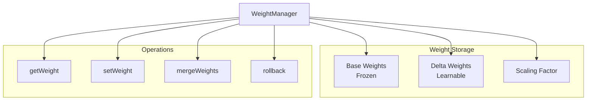
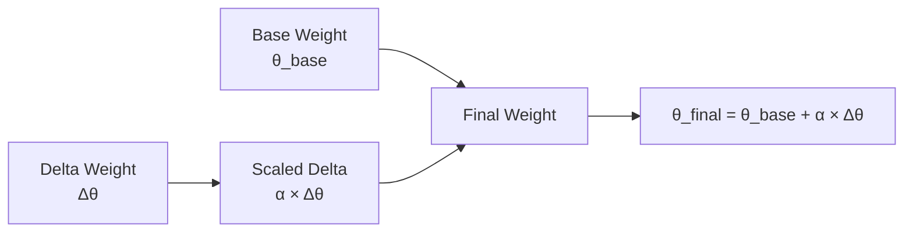

# WeightManager

**File:** `src/learning/WeightManager.ts` (~200 lines)

The WeightManager handles LoRA-style efficient weight updates for pattern learning.

## Overview



## Class Structure

```typescript
class WeightManager {
  private storage: SQLiteStorage;
  private baseWeights: Map<string, number>;
  private deltaWeights: Map<string, number>;
  private scalingFactor: number;
  private history: WeightChange[];

  constructor(storage: SQLiteStorage, options?: WeightManagerOptions) {
    this.storage = storage;
    this.baseWeights = new Map();
    this.deltaWeights = new Map();
    this.scalingFactor = options?.scalingFactor ?? 1.0;
    this.history = [];
  }
}
```

## LoRA-style Weight Computation



### Weight Formula

```
final_weight = base_weight + (delta_weight × scaling_factor)

Where:
- base_weight: Original frozen weight (never modified)
- delta_weight: Learned adjustment (updated during training)
- scaling_factor: Controls adaptation magnitude (default: 1.0)
```

## Core Methods

### getWeight()

```typescript
async getWeight(patternId: string): Promise<number> {
  // Get base weight (or default 0.5)
  const baseWeight = this.baseWeights.get(patternId) ?? 0.5;

  // Get delta weight (or 0)
  const deltaWeight = this.deltaWeights.get(patternId) ?? 0;

  // Compute final weight
  const finalWeight = baseWeight + (deltaWeight * this.scalingFactor);

  // Clamp to [0, 1]
  return Math.max(0, Math.min(1, finalWeight));
}
```

### setWeight()

```typescript
async setWeight(patternId: string, newWeight: number): Promise<void> {
  // Get current base weight
  const baseWeight = this.baseWeights.get(patternId) ?? 0.5;

  // Calculate required delta
  const newDelta = (newWeight - baseWeight) / this.scalingFactor;

  // Store delta
  const oldDelta = this.deltaWeights.get(patternId) ?? 0;
  this.deltaWeights.set(patternId, newDelta);

  // Record change for drift tracking
  this.history.push({
    patternId,
    oldWeight: baseWeight + (oldDelta * this.scalingFactor),
    newWeight,
    timestamp: Date.now()
  });

  // Persist to storage
  await this.persistDelta(patternId, newDelta);
}
```

### applyGradient()

```typescript
async applyGradient(
  patternId: string,
  gradient: number
): Promise<number> {
  const currentWeight = await this.getWeight(patternId);
  const newWeight = Math.max(0, Math.min(1, currentWeight + gradient));

  await this.setWeight(patternId, newWeight);

  return newWeight;
}
```

## Batch Operations

### getWeights()

```typescript
async getWeights(patternIds: string[]): Promise<Map<string, number>> {
  const weights = new Map<string, number>();

  for (const id of patternIds) {
    weights.set(id, await this.getWeight(id));
  }

  return weights;
}
```

### setWeights()

```typescript
async setWeights(weights: Map<string, number>): Promise<void> {
  for (const [id, weight] of weights) {
    await this.setWeight(id, weight);
  }
}
```

## Weight Merging

### mergeWeights()

Periodically merge deltas into base weights:

```typescript
async mergeWeights(): Promise<number> {
  let merged = 0;

  for (const [patternId, delta] of this.deltaWeights) {
    const baseWeight = this.baseWeights.get(patternId) ?? 0.5;
    const finalWeight = baseWeight + (delta * this.scalingFactor);

    // Update base weight
    this.baseWeights.set(patternId, Math.max(0, Math.min(1, finalWeight)));

    // Clear delta
    this.deltaWeights.delete(patternId);

    merged++;
  }

  // Persist merged base weights
  await this.persistBaseWeights();

  // Clear delta storage
  await this.clearDeltaStorage();

  return merged;
}
```

## Rollback Support

### createCheckpoint()

```typescript
interface WeightCheckpoint {
  id: string;
  baseWeights: Map<string, number>;
  deltaWeights: Map<string, number>;
  timestamp: number;
}

async createCheckpoint(): Promise<string> {
  const checkpoint: WeightCheckpoint = {
    id: generateId('chk'),
    baseWeights: new Map(this.baseWeights),
    deltaWeights: new Map(this.deltaWeights),
    timestamp: Date.now()
  };

  await this.storage.storeCheckpoint(checkpoint);

  return checkpoint.id;
}
```

### rollback()

```typescript
async rollback(checkpointId: string): Promise<void> {
  const checkpoint = await this.storage.getCheckpoint(checkpointId);

  if (!checkpoint) {
    throw new Error(`Checkpoint not found: ${checkpointId}`);
  }

  this.baseWeights = new Map(checkpoint.baseWeights);
  this.deltaWeights = new Map(checkpoint.deltaWeights);

  await this.persistAllWeights();
}
```

### rollbackSteps()

```typescript
async rollbackSteps(steps: number): Promise<number> {
  if (this.history.length < steps) {
    steps = this.history.length;
  }

  // Reverse recent changes
  for (let i = 0; i < steps; i++) {
    const change = this.history.pop();
    if (change) {
      await this.setWeight(change.patternId, change.oldWeight);
    }
  }

  return steps;
}
```

## Pattern Management

### getAllPatterns()

```typescript
interface PatternInfo {
  id: string;
  name: string;
  weight: number;
  uses: number;
  successCount: number;
  successRate: number;
  lastUsed: number;
}

async getAllPatterns(): Promise<PatternInfo[]> {
  const patterns: PatternInfo[] = [];
  const stats = await this.storage.getPatternStats();

  for (const [id, stat] of stats) {
    const weight = await this.getWeight(id);

    patterns.push({
      id,
      name: stat.name,
      weight,
      uses: stat.uses,
      successCount: stat.successCount,
      successRate: stat.uses > 0 ? stat.successCount / stat.uses : 0,
      lastUsed: stat.lastUsed
    });
  }

  return patterns;
}
```

### removePattern()

```typescript
async removePattern(patternId: string): Promise<void> {
  this.baseWeights.delete(patternId);
  this.deltaWeights.delete(patternId);

  await this.storage.deletePattern(patternId);
}
```

## History Tracking

### getRecentChanges()

```typescript
interface WeightChange {
  patternId: string;
  oldWeight: number;
  newWeight: number;
  timestamp: number;
}

getRecentChanges(limit: number): number[] {
  const recent = this.history.slice(-limit);
  return recent.map(c => Math.abs(c.newWeight - c.oldWeight));
}
```

### getChangeHistory()

```typescript
getChangeHistory(
  patternId?: string,
  limit: number = 100
): WeightChange[] {
  let history = this.history;

  if (patternId) {
    history = history.filter(c => c.patternId === patternId);
  }

  return history.slice(-limit);
}
```

## Persistence

### persistDelta()

```typescript
private async persistDelta(patternId: string, delta: number): Promise<void> {
  await this.storage.run(`
    INSERT OR REPLACE INTO pattern_deltas (pattern_id, delta, updated_at)
    VALUES (?, ?, ?)
  `, [patternId, delta, Date.now()]);
}
```

### loadWeights()

```typescript
async loadWeights(): Promise<void> {
  // Load base weights
  const baseRows = await this.storage.all(`
    SELECT pattern_id, weight FROM pattern_weights
  `);

  for (const row of baseRows) {
    this.baseWeights.set(row.pattern_id, row.weight);
  }

  // Load deltas
  const deltaRows = await this.storage.all(`
    SELECT pattern_id, delta FROM pattern_deltas
  `);

  for (const row of deltaRows) {
    this.deltaWeights.set(row.pattern_id, row.delta);
  }
}
```

## Configuration

| Option | Type | Default | Description |
|--------|------|---------|-------------|
| `scalingFactor` | number | `1.0` | Delta weight multiplier |
| `defaultWeight` | number | `0.5` | Default for new patterns |
| `historyLimit` | number | `1000` | Max history entries |
| `mergeThreshold` | number | `0.01` | Min delta for merge |

## Usage Example

```typescript
const weightManager = new WeightManager(storage, {
  scalingFactor: 1.0,
  defaultWeight: 0.5
});

// Load persisted weights
await weightManager.loadWeights();

// Get pattern weight
const weight = await weightManager.getWeight('route:pattern_match');
console.log(`Current weight: ${weight}`);

// Apply gradient
const newWeight = await weightManager.applyGradient(
  'route:pattern_match',
  0.02  // Positive gradient
);
console.log(`New weight: ${newWeight}`);

// Create checkpoint before major changes
const checkpointId = await weightManager.createCheckpoint();

// Make changes...

// Rollback if needed
await weightManager.rollback(checkpointId);

// Periodic merge
const merged = await weightManager.mergeWeights();
console.log(`Merged ${merged} patterns`);
```

## Integration with SonaEngine

```typescript
// In SonaEngine
class SonaEngine {
  private weightManager: WeightManager;

  async provideFeedback(trajectoryId: string, quality: number) {
    const gradient = this.calculateGradient(quality);
    const patterns = this.extractPatterns(trajectory);

    for (const pattern of patterns) {
      await this.weightManager.applyGradient(pattern.id, gradient);
    }
  }
}
```

## Next Steps

- [EWCRegularizer](ewc-regularizer.md) - Regularization details
- [SonaEngine](sona-engine.md) - Main learning engine
- [Learning System](index.md) - System overview
