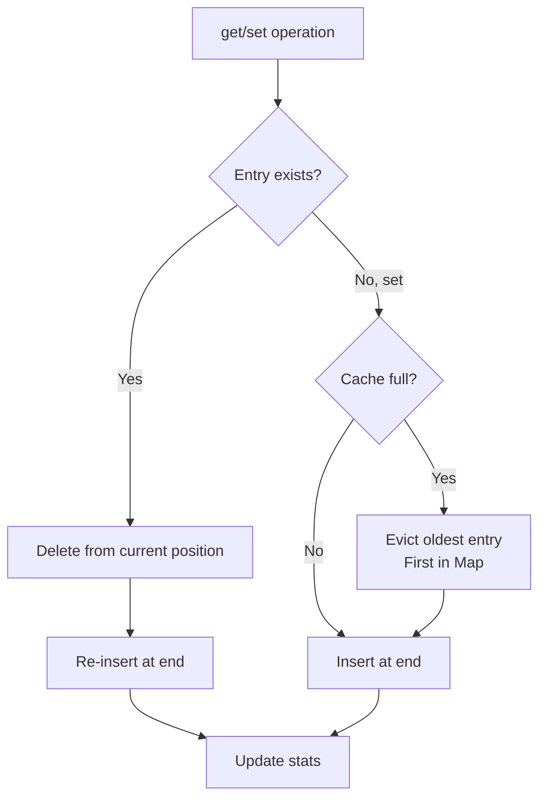

# EmbeddingCache

**File:** `src/memory/EmbeddingCache.ts` (~351 lines)

The EmbeddingCache provides an LRU cache for frequently accessed embeddings with TTL expiration.

## Overview

```mermaid
graph TB
    EC[EmbeddingCache]

    subgraph "Cache Structure"
        LRU[LRU Map<br/>Content Hash → Embedding]
        TTL[TTL Tracker<br/>Expiration Times]
        STATS[Statistics<br/>Hits/Misses/Evictions]
    end

    subgraph "Operations"
        GET[get()]
        SET[set()]
        GOC[getOrCreate()]
        PRUNE[prune()]
    end

    EC --> LRU
    EC --> TTL
    EC --> STATS

    EC --> GET
    EC --> SET
    EC --> GOC
    EC --> PRUNE
```

## Class Structure

```typescript
class EmbeddingCache {
  private cache: Map<string, CacheEntry>;
  private maxSize: number;
  private ttl: number;
  private stats: CacheStats;

  constructor(options: EmbeddingCacheOptions) {
    this.cache = new Map();
    this.maxSize = options.maxSize ?? 10000;
    this.ttl = options.ttl ?? 3600000; // 1 hour
    this.stats = { hits: 0, misses: 0, evictions: 0 };
  }
}
```

## Cache Entry

```typescript
interface CacheEntry {
  embedding: number[];
  contentHash: string;
  createdAt: number;
  lastAccessed: number;
  accessCount: number;
}

interface CacheStats {
  hits: number;
  misses: number;
  evictions: number;
  size: number;
  hitRate: number;
}
```

## Constructor Options

```typescript
interface EmbeddingCacheOptions {
  maxSize?: number;       // Max entries (default: 10000)
  ttl?: number;           // TTL in ms (default: 3600000 = 1 hour)
  hashAlgorithm?: string; // Hash algorithm (default: 'sha256')
}

const cache = new EmbeddingCache({
  maxSize: 10000,
  ttl: 3600000
});
```

## Core Methods

### get()

```typescript
get(content: string): number[] | null {
  const hash = this.hashContent(content);
  const entry = this.cache.get(hash);

  if (!entry) {
    this.stats.misses++;
    return null;
  }

  // Check TTL expiration
  if (this.isExpired(entry)) {
    this.cache.delete(hash);
    this.stats.misses++;
    return null;
  }

  // Update access metadata
  entry.lastAccessed = Date.now();
  entry.accessCount++;

  // Move to end (most recently used)
  this.cache.delete(hash);
  this.cache.set(hash, entry);

  this.stats.hits++;
  return entry.embedding;
}
```

### set()

```typescript
set(content: string, embedding: number[]): void {
  const hash = this.hashContent(content);

  // Evict if at capacity
  if (this.cache.size >= this.maxSize && !this.cache.has(hash)) {
    this.evictLRU();
  }

  const entry: CacheEntry = {
    embedding,
    contentHash: hash,
    createdAt: Date.now(),
    lastAccessed: Date.now(),
    accessCount: 1
  };

  this.cache.set(hash, entry);
}
```

### getOrCreate()

```typescript
async getOrCreate(
  content: string,
  createFn: (content: string) => Promise<number[]>
): Promise<number[]> {
  // Try cache first
  const cached = this.get(content);
  if (cached) {
    return cached;
  }

  // Create new embedding
  const embedding = await createFn(content);

  // Store in cache
  this.set(content, embedding);

  return embedding;
}
```

## LRU Implementation



### evictLRU()

```typescript
private evictLRU(): void {
  // Map iteration order is insertion order
  // First entry is least recently used
  const oldestKey = this.cache.keys().next().value;

  if (oldestKey) {
    this.cache.delete(oldestKey);
    this.stats.evictions++;
  }
}
```

## TTL Management

### isExpired()

```typescript
private isExpired(entry: CacheEntry): boolean {
  return Date.now() - entry.createdAt > this.ttl;
}
```

### prune()

```typescript
prune(): number {
  let pruned = 0;
  const now = Date.now();

  for (const [hash, entry] of this.cache) {
    if (now - entry.createdAt > this.ttl) {
      this.cache.delete(hash);
      pruned++;
    }
  }

  return pruned;
}
```

### Auto-Prune

```typescript
// Enable periodic pruning
startAutoPrune(intervalMs: number = 300000): void {
  this.pruneInterval = setInterval(() => {
    this.prune();
  }, intervalMs);
}

stopAutoPrune(): void {
  if (this.pruneInterval) {
    clearInterval(this.pruneInterval);
    this.pruneInterval = null;
  }
}
```

## Content Hashing

```typescript
private hashContent(content: string): string {
  return crypto
    .createHash('sha256')
    .update(content)
    .digest('hex')
    .substring(0, 16);  // Use first 16 chars for efficiency
}
```

## Statistics

### getStats()

```typescript
getStats(): CacheStats {
  const total = this.stats.hits + this.stats.misses;

  return {
    hits: this.stats.hits,
    misses: this.stats.misses,
    evictions: this.stats.evictions,
    size: this.cache.size,
    hitRate: total > 0 ? this.stats.hits / total : 0
  };
}
```

### resetStats()

```typescript
resetStats(): void {
  this.stats = {
    hits: 0,
    misses: 0,
    evictions: 0
  };
}
```

## Batch Operations

### getMany()

```typescript
getMany(contents: string[]): Map<string, number[] | null> {
  const results = new Map<string, number[] | null>();

  for (const content of contents) {
    results.set(content, this.get(content));
  }

  return results;
}
```

### setMany()

```typescript
setMany(entries: Array<{ content: string; embedding: number[] }>): void {
  for (const { content, embedding } of entries) {
    this.set(content, embedding);
  }
}
```

### getOrCreateMany()

```typescript
async getOrCreateMany(
  contents: string[],
  createFn: (contents: string[]) => Promise<number[][]>
): Promise<Map<string, number[]>> {
  const results = new Map<string, number[]>();
  const uncached: string[] = [];
  const uncachedIndices: number[] = [];

  // Check cache for each content
  for (let i = 0; i < contents.length; i++) {
    const content = contents[i];
    const cached = this.get(content);

    if (cached) {
      results.set(content, cached);
    } else {
      uncached.push(content);
      uncachedIndices.push(i);
    }
  }

  // Batch create uncached embeddings
  if (uncached.length > 0) {
    const newEmbeddings = await createFn(uncached);

    for (let i = 0; i < uncached.length; i++) {
      const content = uncached[i];
      const embedding = newEmbeddings[i];

      this.set(content, embedding);
      results.set(content, embedding);
    }
  }

  return results;
}
```

## Memory Management

### clear()

```typescript
clear(): void {
  this.cache.clear();
  this.resetStats();
}
```

### resize()

```typescript
resize(newMaxSize: number): void {
  this.maxSize = newMaxSize;

  // Evict if over new capacity
  while (this.cache.size > this.maxSize) {
    this.evictLRU();
  }
}
```

### getMemoryUsage()

```typescript
getMemoryUsage(): MemoryUsage {
  let totalBytes = 0;

  for (const entry of this.cache.values()) {
    // 8 bytes per float64
    totalBytes += entry.embedding.length * 8;
    // Overhead for metadata
    totalBytes += 100; // Approximate
  }

  return {
    entries: this.cache.size,
    bytes: totalBytes,
    megabytes: totalBytes / (1024 * 1024)
  };
}
```

## Configuration

| Option | Type | Default | Description |
|--------|------|---------|-------------|
| `maxSize` | number | `10000` | Maximum cache entries |
| `ttl` | number | `3600000` | Time-to-live (1 hour) |
| `hashAlgorithm` | string | `sha256` | Hash algorithm |

## Performance Characteristics

| Operation | Time Complexity | Notes |
|-----------|-----------------|-------|
| `get()` | O(1) | Hash lookup |
| `set()` | O(1) | May trigger eviction |
| `getOrCreate()` | O(1) + embed time | Cache miss requires embedding |
| `prune()` | O(n) | Iterates all entries |
| `evictLRU()` | O(1) | First entry in Map |

## Memory Estimates

```
768-dim embedding = 768 × 8 bytes = 6,144 bytes
10,000 entries = ~60 MB

Including overhead:
10,000 entries ≈ 70 MB total
```

## Usage Example

```typescript
const cache = new EmbeddingCache({
  maxSize: 10000,
  ttl: 3600000  // 1 hour
});

// Start auto-pruning every 5 minutes
cache.startAutoPrune(300000);

// Usage with OpenAI embeddings
const embedding = await cache.getOrCreate(
  "The authentication module uses JWT",
  async (content) => {
    const response = await openai.embeddings.create({
      model: 'text-embedding-3-small',
      input: content,
      dimensions: 768
    });
    return response.data[0].embedding;
  }
);

// Check stats
const stats = cache.getStats();
console.log(`Hit rate: ${(stats.hitRate * 100).toFixed(1)}%`);

// Cleanup
cache.stopAutoPrune();
```

## Integration with MemoryEngine

```typescript
// In MemoryEngine
class MemoryEngine {
  private embeddingCache: EmbeddingCache;

  constructor(config: Config) {
    this.embeddingCache = new EmbeddingCache({
      maxSize: config.embeddingCacheSize ?? 10000,
      ttl: config.embeddingCacheTTL ?? 3600000
    });
  }

  private async getEmbedding(content: string): Promise<number[]> {
    return this.embeddingCache.getOrCreate(
      content,
      (c) => this.embedWithOpenAI(c)
    );
  }
}
```

## Cache Warming

```typescript
async warmCache(frequentQueries: string[]): Promise<void> {
  console.log(`Warming cache with ${frequentQueries.length} queries...`);

  // Batch embed for efficiency
  await this.getOrCreateMany(
    frequentQueries,
    async (contents) => {
      // Batch API call
      const response = await openai.embeddings.create({
        model: 'text-embedding-3-small',
        input: contents,
        dimensions: 768
      });
      return response.data.map(d => d.embedding);
    }
  );

  console.log('Cache warming complete');
}
```

## Next Steps

- [AsyncWriteQueue](async-write-queue.md) - Non-blocking writes
- [Memory System](index.md) - Memory system overview
- [MemoryEngine](../core/memory-engine.md) - Core memory API
