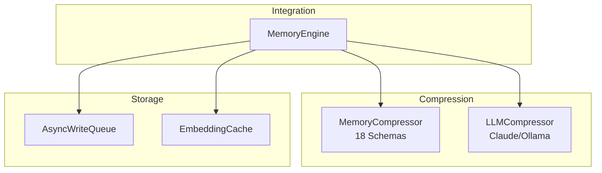
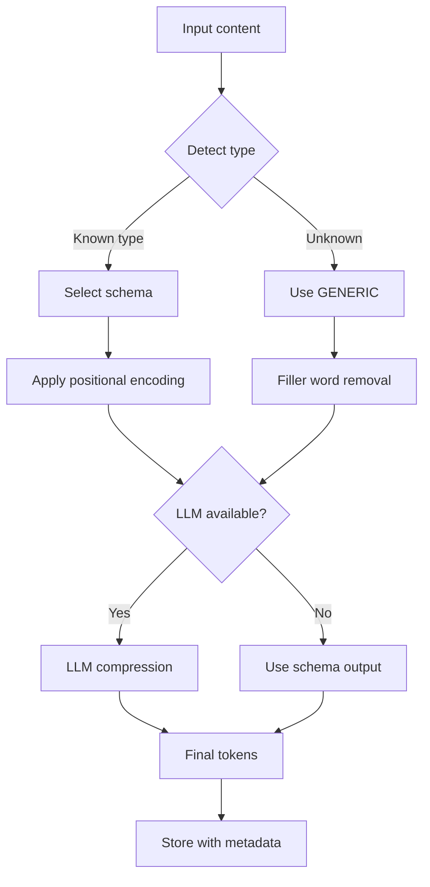
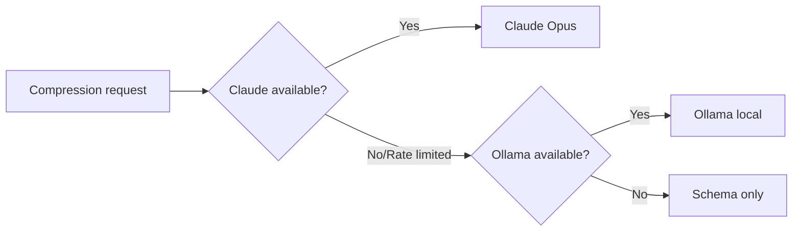

# Memory System Documentation

The memory system provides efficient storage, retrieval, and compression of information with provenance tracking.

## Overview



## File Reference

| File | Lines | Purpose |
|------|-------|---------|
| [CompressionSchemas](compression-schemas.md) | ~1070 | 18 positional schemas |
| [MemoryCompressor](memory-compressor.md) | ~392 | Schema-based compression |
| [LLMCompressor](llm-compressor.md) | ~260 | LLM-based compression |
| [EmbeddingCache](embedding-cache.md) | ~351 | Embedding LRU cache |
| [AsyncWriteQueue](async-write-queue.md) | ~298 | Non-blocking writes |
| types.ts | ~194 | Type definitions |
| index.ts | ~21 | Exports |

## Compression System

Two-stage compression for maximum token efficiency:

### Stage 1: Schema Compression

18 positional schemas for structured data:

```
Input:  "TaskExecutor is an orchestrator component..."
Output: "TaskExecutor|O|exe.dec.heal|CG.SH|codex/TaskExecutor.ts|1800"
```

Compression ratio: 50-75%

### Stage 2: LLM Compression

Semantic compression for remaining content:

```
Input:  "The authentication module uses JWT tokens..."
Output: "auth|jwt|24h_expiry|security"
```

Additional reduction: 60-70%

## Compression Flow



## 18 Compression Schemas

| Schema | Format | Ratio |
|--------|--------|-------|
| COMPONENT | `name\|type\|actions\|deps\|path\|lines` | 65-75% |
| DEPARTMENT | `name\|role\|actions\|agents\|phase\|path` | 60-70% |
| MCP_TOOL | `name\|action\|params\|returns\|uses` | 50-65% |
| CAPABILITY | `name\|actions\|langs\|apis\|path` | 55-70% |
| WORKFLOW | `name\|steps\|actors\|budget` | 50-60% |
| CONFIG | `name\|vars\|defaults` | 40-55% |
| ERROR_PATTERN | `id\|symptom\|root\|fix\|file` | 45-60% |
| SUCCESS_PATTERN | `name\|factors\|rate\|context` | 40-55% |
| SYSTEM | `name\|modes\|core\|storage\|embed` | 60-75% |
| BUG_FIX | `id\|status\|symptom\|root\|fix\|file\|lesson` | 55-70% |
| DEV_FEATURE | `name\|type\|purpose\|path\|exports\|wiring` | 50-65% |
| ARCH_INSIGHT | `name\|type\|insight\|pattern\|rule\|comps` | 55-70% |
| CONVERSATION | `task_id\|department\|attempt\|model\|tools\|files\|outcome\|duration\|error\|summary` | 60-75% |
| CONTEXT_BUNDLE | `CTX\|task_id\|desc\|files\|mem\|deps\|patterns\|style` | 55-70% |
| DESIGN | `DES\|comps\|models\|files\|apis\|notes` | 50-65% |
| EXEC_PLAN | `PLAN\|dept\|ops\|cmd\|conf\|notes` | 50-60% |
| VALIDATION | `VAL\|approve\|tests\|sec\|perf\|mods\|block` | 45-60% |
| GENERIC | Filler word removal | 30-40% |

See [Compression Schemas](compression-schemas.md) for complete documentation.

## LLM Compression

### Compression Prompt

```
You are a semantic compression engine. Extract the pure meaning...
- Strip ALL filler words
- Use abbreviations (comp, cfg, fn, impl, req, res, err, msg)
- Use | as delimiter
- Use → for flows
- Use . for lists
```

### Decompression Prompt

```
You are a semantic decompression engine. Expand these compressed tokens...
- Expand ALL abbreviations
- Restore natural language structure
- Preserve ALL semantic meaning
```

See [All Prompts](../prompts/all-prompts.md) for complete prompt text.

## Embedding System

### EmbeddingCache

LRU cache for frequently accessed embeddings:

```typescript
const cache = new EmbeddingCache({
  maxSize: 10000,
  ttl: 3600000  // 1 hour
});

// Automatic caching
const embedding = await cache.getOrCreate(content, embedFn);
```

### EmbeddingQueue

Batch embedding for efficiency:

```typescript
const queue = new EmbeddingQueue({
  batchSize: 100,
  flushInterval: 5000
});

// Entries are batched automatically
await queue.add(entryId, content);
```

## AsyncWriteQueue

Non-blocking writes for performance:

```typescript
const queue = new AsyncWriteQueue({
  maxQueueSize: 1000,
  flushThreshold: 100,
  flushInterval: 1000
});

// Non-blocking enqueue
await queue.enqueue(writeOperation);

// Wait for all pending writes
await queue.waitForDrain();
```

## Token Savings

```
1 character ≈ 0.25 tokens (average)

Example:
Original:  845 characters
Compressed: 264 characters
Saved:     581 characters ≈ 145 tokens
Reduction: 69%
```

## Provider Fallback



## MCP Tools

### god_store

Store with automatic compression:

```typescript
await mcp__rubix__god_store({
  content: "Content to store",
  tags: ["tag1", "tag2"],
  type: "component"  // Optional: specify schema
});
```

### god_query_expanded

Query with automatic expansion:

```typescript
const results = await mcp__rubix__god_query_expanded({
  query: "search term",
  topK: 10
});
// Returns human-readable results
```

### god_compression_stats

Get compression statistics:

```typescript
const stats = await mcp__rubix__god_compression_stats();
// Returns: totalCompressed, avgRatio, tokensSaved, etc.
```

### god_recompress_all

Recompress uncompressed entries:

```typescript
await mcp__rubix__god_recompress_all({ dryRun: false });
```

## Next Steps

- [Compression Schemas](compression-schemas.md) - All 18 schemas in detail
- [LLM Compressor](llm-compressor.md) - LLM-based compression
- [All Prompts](../prompts/all-prompts.md) - Compression/decompression prompts
