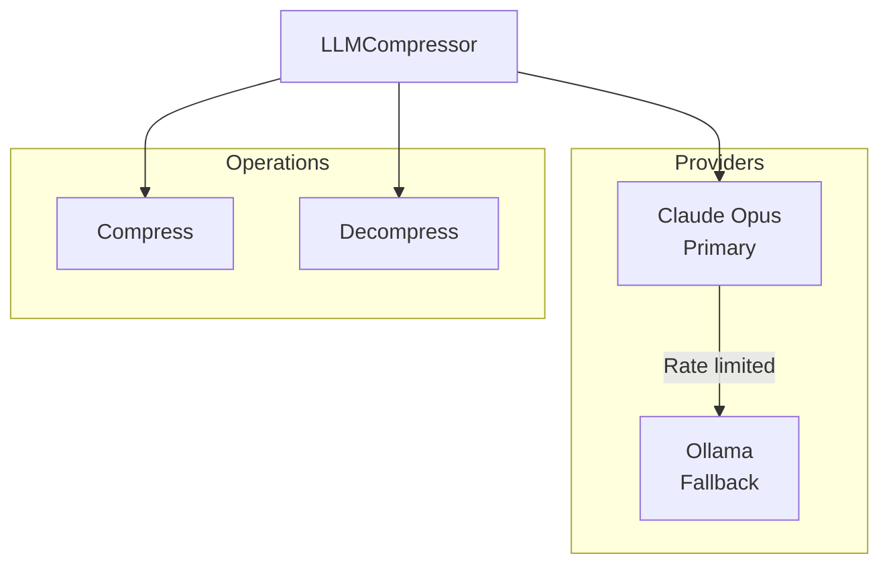
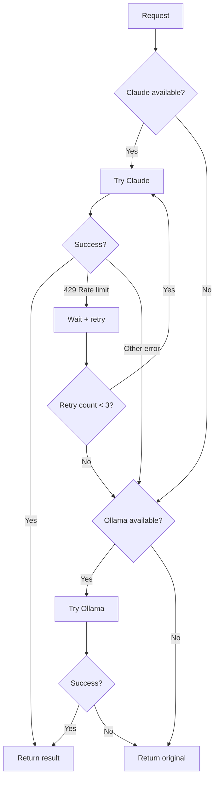

# LLMCompressor

**File:** `src/memory/LLMCompressor.ts` (~260 lines)

The LLMCompressor provides semantic compression using LLMs (Claude Opus primary, Ollama fallback).

## Overview



## Class Structure

```typescript
class LLMCompressor {
  private anthropicClient: Anthropic | null;
  private ollamaEndpoint: string | null;
  private ollamaModel: string;
  private rateLimitWaitMs: number;
}
```

## Constructor

```typescript
const compressor = new LLMCompressor({
  anthropicApiKey: process.env.ANTHROPIC_API_KEY,
  ollamaEndpoint: process.env.OLLAMA_ENDPOINT,  // Optional
  ollamaModel: 'qwen2.5-coder:32b',
  rateLimitWaitMs: 60000
});
```

## Compression

### compress()

```typescript
interface CompressResult {
  compressed: string;
  original: string;
  ratio: number;
  provider: 'claude' | 'ollama' | 'none';
}

const result = await compressor.compress(
  "The authentication module uses JWT tokens with 24-hour expiry..."
);

// Result:
// {
//   compressed: "auth|jwt|24h_expiry|security",
//   original: "The authentication module...",
//   ratio: 0.31,  // 69% reduction
//   provider: 'claude'
// }
```

### Compression Prompt

```
You are a semantic compression engine. Extract the pure meaning from this content using minimal tokens.

Rules:
- Strip ALL filler words (the, a, an, please, basically, actually, etc.)
- Strip ALL NLP pleasantries
- Keep ONLY semantic content that carries meaning
- Use abbreviations for common patterns:
  - comp = component
  - cfg = configuration/config
  - fn = function
  - impl = implementation
  - req = request/requirement
  - res = response
  - err = error
  - msg = message
- Use | as delimiter between distinct fields/concepts
- Use → for flows/sequences/causation
- Use . for lists within a field (A.B.C)
- Preserve technical terms, names, paths, and specific values exactly
- Format: TYPE|KEY_INFO|DETAILS|CONTEXT (adapt as needed)

Content to compress:
{CONTENT}

Output ONLY the compressed tokens. No explanation, no meta-commentary.
```

### Compression Examples

| Input | Output | Reduction |
|-------|--------|-----------|
| "The TaskExecutor is an orchestrator component that executes tasks, decomposes them into subtasks, and heals from failures. It depends on CodeGenerator and SelfHealer. Location: codex/TaskExecutor.ts (~1800 lines)" | "TaskExecutor\|O\|exe.dec.heal\|CG.SH\|codex/TaskExecutor.ts\|1800" | ~70% |
| "The authentication module uses JWT tokens with a 24-hour expiry time for secure session management" | "auth\|jwt\|24h_expiry\|security\|session" | ~65% |
| "Error: TypeError at line 42 in auth.ts - Cannot read property 'user' of undefined" | "err\|TypeError\|auth.ts:42\|user_undefined" | ~60% |

## Decompression

### decompress()

```typescript
interface DecompressResult {
  expanded: string;
  compressed: string;
  provider: 'claude' | 'ollama' | 'none';
}

const result = await compressor.decompress(
  "TaskExecutor|O|exe.dec.heal|CG.SH|codex/TaskExecutor.ts|1800"
);

// Result:
// {
//   expanded: "TaskExecutor is an orchestrator component. Actions: execute, decompose, heal. Dependencies: CodeGenerator, SelfHealer. Location: codex/TaskExecutor.ts (~1800 lines)",
//   compressed: "TaskExecutor|O|exe.dec.heal...",
//   provider: 'claude'
// }
```

### Decompression Prompt

```
You are a semantic decompression engine. Expand these compressed tokens to full human-readable meaning.

Rules:
- Expand ALL abbreviations to full words
- Restore natural language structure with proper grammar
- Preserve ALL semantic meaning - nothing should be lost
- Output clear, professional prose
- Maintain technical accuracy
- Do NOT add information that wasn't in the original

Compressed tokens:
{COMPRESSED}

Output ONLY the expanded human-readable text. No meta-commentary.
```

## Provider Selection



### Claude Execution

```typescript
private async compressWithClaude(content: string): Promise<string> {
  const response = await this.anthropicClient!.messages.create({
    model: 'claude-opus-4-5-20251101',
    max_tokens: 1024,
    messages: [{
      role: 'user',
      content: this.buildCompressionPrompt(content)
    }]
  });

  return response.content
    .filter(c => c.type === 'text')
    .map(c => c.text)
    .join('');
}
```

### Ollama Fallback

```typescript
private async compressWithOllama(content: string): Promise<string> {
  const response = await fetch(`${this.ollamaEndpoint}/api/generate`, {
    method: 'POST',
    headers: { 'Content-Type': 'application/json' },
    body: JSON.stringify({
      model: this.ollamaModel,
      prompt: this.buildCompressionPrompt(content),
      stream: false
    })
  });

  const data = await response.json();
  return data.response;
}
```

## Rate Limit Handling

```typescript
private async handleRateLimit(): Promise<void> {
  console.warn(`Rate limited. Waiting ${this.rateLimitWaitMs}ms...`);
  await delay(this.rateLimitWaitMs);
}
```

## Standard Abbreviations

| Abbreviation | Expansion |
|--------------|-----------|
| comp | component |
| cfg | configuration/config |
| fn | function |
| impl | implementation |
| req | request/requirement |
| res | response |
| err | error |
| msg | message |
| exec | execute |
| init | initialize |
| param | parameter |
| ctx | context |
| deps | dependencies |

## Delimiter Conventions

| Delimiter | Meaning | Example |
|-----------|---------|---------|
| `\|` | Field separator | `name\|type\|actions` |
| `→` | Flow/sequence | `input→process→output` |
| `.` | List items | `exe.dec.heal` |
| `:` | Key-value | `content:string` |
| `,` | Enumeration | `path1,path2,path3` |

## Compression Metrics

Typical results with LLM compression:

| Content Type | Original | Compressed | Reduction |
|--------------|----------|------------|-----------|
| Failure record | 845 chars | 264 chars | 69% |
| Component docs | 400 chars | 120 chars | 70% |
| Error pattern | 300 chars | 90 chars | 70% |
| Generic text | 200 chars | 140 chars | 30% |

## Configuration

| Option | Type | Default | Description |
|--------|------|---------|-------------|
| `anthropicApiKey` | string | - | Anthropic API key |
| `ollamaEndpoint` | string | `http://localhost:11434` | Ollama endpoint |
| `ollamaModel` | string | `qwen2.5-coder:32b` | Ollama model |
| `rateLimitWaitMs` | number | `60000` | Rate limit wait (ms) |

## Usage

```typescript
const compressor = new LLMCompressor(config);

// Compress
const { compressed, ratio } = await compressor.compress(content);
console.log(`Compressed: ${ratio * 100}% reduction`);

// Decompress
const { expanded } = await compressor.decompress(compressed);
console.log(`Expanded: ${expanded}`);
```

## Integration with MemoryEngine

```typescript
// In MemoryEngine.store()
let finalContent = content;

if (this.llmCompressor.isAvailable()) {
  const { compressed, ratio } = await this.llmCompressor.compress(content);
  if (ratio < 0.8) {  // At least 20% reduction
    finalContent = compressed;
    tags.push('llm-compressed');
  }
}
```

## Next Steps

- [Compression Schemas](compression-schemas.md) - Schema-based compression
- [All Prompts](../prompts/all-prompts.md) - Complete prompt reference
- [Memory System](index.md) - Memory system overview
