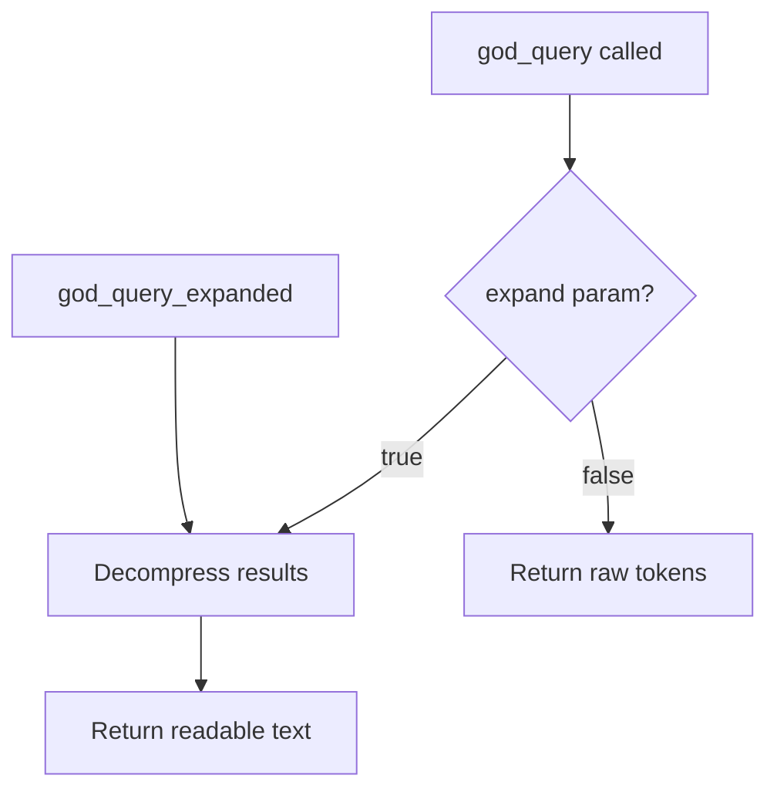

# Decompression Prompt

Expands compressed tokens back to human-readable text.

## Location

`src/memory/LLMCompressor.ts:229-242`

## Used By

- `god_query_expanded` - Auto-expand query results
- Memory retrieval pipeline

---

## The Prompt

```text
You are a semantic decompression engine. Expand these compressed tokens to full human-readable meaning.

Rules:
- Expand ALL abbreviations to full words
- Restore natural language structure with proper grammar
- Preserve ALL semantic meaning - nothing should be lost
- Output clear, professional prose
- Maintain technical accuracy
- Do NOT add information that wasn't in the original

Compressed tokens:
{COMPRESSED}

Output ONLY the expanded human-readable text. No meta-commentary.
```

---

## Example

### Input (Compressed)
```text
TaskExecutor|O|exe.dec.heal|CG.SH|codex/TaskExecutor.ts|1800
```

### Output (Expanded)
```text
TaskExecutor is an orchestrator component.
Actions: execute, decompose, heal
Dependencies: CodeGenerator, SelfHealer
Location: codex/TaskExecutor.ts (~1800 lines)
```

---

## Key Rules

| Rule | Purpose |
|------|---------|
| Expand abbreviations | `cfg` → `configuration` |
| Restore grammar | Natural sentence structure |
| Preserve meaning | No semantic loss |
| No additions | Don't invent information |
| Professional prose | Clear, readable output |

---

## Abbreviation Expansion

| Compressed | Expanded |
|------------|----------|
| comp | component |
| cfg | configuration |
| fn | function |
| impl | implementation |
| req | request/requirement |
| res | response |
| err | error |
| msg | message |
| exec | execute |
| init | initialize |
| ctx | context |
| deps | dependencies |

---

## Delimiter Interpretation

| Symbol | Interpretation |
|--------|----------------|
| `\|` | Separate fields into sections |
| `→` | Describe as flow or sequence |
| `.` | Expand as comma-separated list |
| `:` | Present as key-value pair |

---

## When Decompression Occurs



---

## Related

- [Compression Prompt](compression-prompt.md) - Forward operation
- [All Prompts](all-prompts.md) - Complete reference
- [Memory Tools](../tools/memory-tools.md) - Query tools
