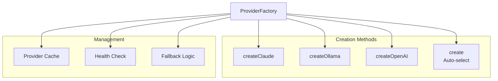

# ProviderFactory

**File:** `src/providers/ProviderFactory.ts` (~150 lines)

The ProviderFactory creates and manages LLM provider instances with automatic fallback handling.

## Overview



## Class Structure

```typescript
class ProviderFactory {
  private static instances: Map<string, LLMProvider> = new Map();
  private static config: ProviderConfig;

  static initialize(config: ProviderConfig): void;
  static create(options?: CreateOptions): LLMProvider;
  static createClaude(options?: ClaudeOptions): ClaudeProvider;
  static createOllama(options?: OllamaOptions): OllamaClient;
  static createOpenAI(options?: OpenAIOptions): OpenAIProvider;
}
```

## Initialization

```typescript
interface ProviderConfig {
  claude?: {
    apiKey: string;
    model?: string;
    maxTokens?: number;
  };
  ollama?: {
    endpoint?: string;
    model?: string;
    timeout?: number;
  };
  openai?: {
    apiKey: string;
    model?: string;
    dimensions?: number;
  };
  defaultProvider?: 'claude' | 'ollama';
  fallbackOrder?: string[];
}

// Initialize at startup
ProviderFactory.initialize({
  claude: {
    apiKey: process.env.ANTHROPIC_API_KEY!,
    model: 'claude-opus-4-5-20251101',
    maxTokens: 8192
  },
  ollama: {
    endpoint: process.env.OLLAMA_ENDPOINT ?? 'http://localhost:11434',
    model: 'qwen2.5-coder:32b'
  },
  openai: {
    apiKey: process.env.OPENAI_API_KEY!,
    model: 'text-embedding-3-small',
    dimensions: 768
  },
  defaultProvider: 'claude',
  fallbackOrder: ['ollama']
});
```

## Creation Methods

### create()

Auto-select provider based on availability:

```typescript
interface CreateOptions {
  provider?: 'claude' | 'ollama' | 'auto';
  purpose?: 'code' | 'compression' | 'embedding';
  requireFallback?: boolean;
}

static create(options: CreateOptions = {}): LLMProvider {
  const { provider = 'auto', purpose, requireFallback = true } = options;

  if (provider === 'auto') {
    return this.selectBestProvider(purpose, requireFallback);
  }

  switch (provider) {
    case 'claude':
      return this.createClaude();
    case 'ollama':
      return this.createOllama();
    default:
      throw new Error(`Unknown provider: ${provider}`);
  }
}
```

### createClaude()

```typescript
interface ClaudeOptions {
  apiKey?: string;
  model?: string;
  maxTokens?: number;
}

static createClaude(options: ClaudeOptions = {}): ClaudeProvider {
  const cacheKey = 'claude';

  if (this.instances.has(cacheKey)) {
    return this.instances.get(cacheKey) as ClaudeProvider;
  }

  const provider = new ClaudeProvider({
    apiKey: options.apiKey ?? this.config.claude?.apiKey,
    model: options.model ?? this.config.claude?.model ?? 'claude-opus-4-5-20251101',
    maxTokens: options.maxTokens ?? this.config.claude?.maxTokens ?? 8192
  });

  this.instances.set(cacheKey, provider);
  return provider;
}
```

### createOllama()

```typescript
interface OllamaOptions {
  endpoint?: string;
  model?: string;
  timeout?: number;
}

static createOllama(options: OllamaOptions = {}): OllamaClient {
  const cacheKey = 'ollama';

  if (this.instances.has(cacheKey)) {
    return this.instances.get(cacheKey) as OllamaClient;
  }

  const client = new OllamaClient({
    endpoint: options.endpoint ?? this.config.ollama?.endpoint ?? 'http://localhost:11434',
    model: options.model ?? this.config.ollama?.model ?? 'qwen2.5-coder:32b',
    timeout: options.timeout ?? this.config.ollama?.timeout ?? 120000
  });

  this.instances.set(cacheKey, client);
  return client;
}
```

### createOpenAI()

```typescript
interface OpenAIOptions {
  apiKey?: string;
  model?: string;
  dimensions?: number;
}

static createOpenAI(options: OpenAIOptions = {}): OpenAIProvider {
  const cacheKey = 'openai';

  if (this.instances.has(cacheKey)) {
    return this.instances.get(cacheKey) as OpenAIProvider;
  }

  const provider = new OpenAIProvider({
    apiKey: options.apiKey ?? this.config.openai?.apiKey,
    model: options.model ?? this.config.openai?.model ?? 'text-embedding-3-small',
    dimensions: options.dimensions ?? this.config.openai?.dimensions ?? 768
  });

  this.instances.set(cacheKey, provider);
  return provider;
}
```

## Provider Selection

```typescript
private static selectBestProvider(
  purpose?: string,
  requireFallback: boolean = true
): LLMProvider {
  // Check Claude availability
  if (this.config.claude?.apiKey) {
    const claude = this.createClaude();

    if (requireFallback) {
      // Wrap with fallback
      return new FallbackProvider(claude, this.createFallbackChain());
    }

    return claude;
  }

  // Fallback to Ollama
  if (this.isOllamaAvailable()) {
    return this.createOllama();
  }

  throw new Error('No LLM providers available');
}

private static createFallbackChain(): LLMProvider[] {
  const chain: LLMProvider[] = [];

  for (const providerName of this.config.fallbackOrder ?? ['ollama']) {
    if (providerName === 'ollama' && this.isOllamaAvailable()) {
      chain.push(this.createOllama());
    }
  }

  return chain;
}
```

## Health Checking

```typescript
static async healthCheck(): Promise<HealthCheckResult> {
  const results: ProviderHealth[] = [];

  // Check Claude
  if (this.config.claude?.apiKey) {
    try {
      const claude = this.createClaude();
      await claude.complete('test', { maxTokens: 10 });
      results.push({ provider: 'claude', status: 'healthy' });
    } catch (error) {
      results.push({
        provider: 'claude',
        status: 'unhealthy',
        error: error.message
      });
    }
  }

  // Check Ollama
  if (this.config.ollama?.endpoint) {
    try {
      const ollama = this.createOllama();
      const available = await ollama.isAvailable();
      results.push({
        provider: 'ollama',
        status: available ? 'healthy' : 'unavailable'
      });
    } catch (error) {
      results.push({
        provider: 'ollama',
        status: 'unhealthy',
        error: error.message
      });
    }
  }

  return {
    healthy: results.every(r => r.status === 'healthy'),
    providers: results
  };
}
```

## Fallback Provider

```typescript
class FallbackProvider implements LLMProvider {
  constructor(
    private primary: LLMProvider,
    private fallbacks: LLMProvider[]
  ) {}

  async complete(prompt: string, options?: CompletionOptions): Promise<string> {
    try {
      return await this.primary.complete(prompt, options);
    } catch (error) {
      // Try fallbacks in order
      for (const fallback of this.fallbacks) {
        try {
          console.warn(`Primary failed, trying fallback: ${fallback.getName()}`);
          return await fallback.complete(prompt, options);
        } catch (fallbackError) {
          continue;
        }
      }

      throw new Error('All providers failed');
    }
  }

  isAvailable(): boolean {
    return this.primary.isAvailable() ||
           this.fallbacks.some(f => f.isAvailable());
  }

  getName(): string {
    return `${this.primary.getName()} (with fallbacks)`;
  }
}
```

## Instance Management

### clearInstances()

```typescript
static clearInstances(): void {
  this.instances.clear();
}
```

### getActiveProviders()

```typescript
static getActiveProviders(): string[] {
  return Array.from(this.instances.keys());
}
```

## Usage Examples

```typescript
// Auto-select best provider
const provider = ProviderFactory.create();

// Specific provider
const claude = ProviderFactory.createClaude();
const ollama = ProviderFactory.createOllama();

// For specific purpose
const codeProvider = ProviderFactory.create({
  purpose: 'code',
  requireFallback: true
});

// Health check
const health = await ProviderFactory.healthCheck();
if (!health.healthy) {
  console.warn('Some providers unhealthy:', health.providers);
}
```

## Next Steps

- [OllamaClient](ollama-client.md) - Local LLM implementation
- [Types](types.md) - Type definitions
- [Providers Overview](index.md) - System overview
