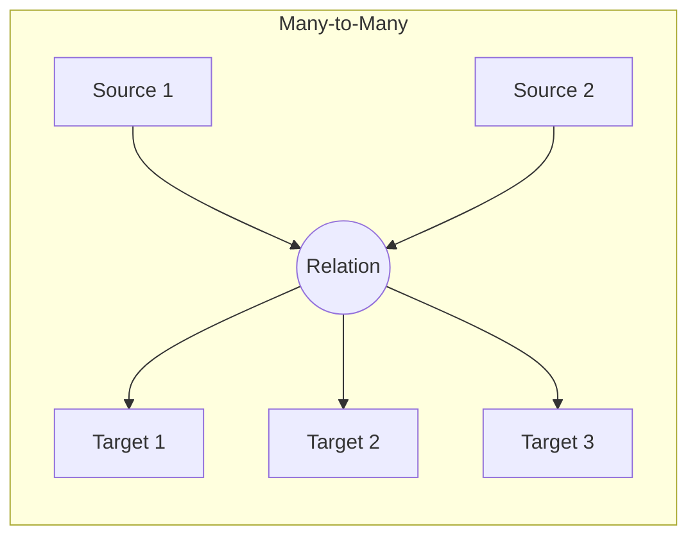

# Causal Tools

Tools for managing causal relationships between memory entries.

## Tool Reference

| Tool | Purpose |
|------|---------|
| [god_causal](#god_causal) | Add causal relation |
| [god_find_paths](#god_find_paths) | Find causal paths |
| [god_shadow_search](#god_shadow_search) | Find contradictions |
| [god_cleanup_expired](#god_cleanup_expired) | Clean expired relations |

---

## god_causal

Add a causal relationship between memory entries.

### Parameters

| Parameter | Type | Required | Description |
|-----------|------|----------|-------------|
| `sourceIds` | string[] | Yes | Source entry IDs |
| `targetIds` | string[] | Yes | Target entry IDs |
| `type` | enum | Yes | Relationship type |
| `strength` | number | No | Strength 0-1 (default: 0.5) |
| `ttl` | number | No | Time-to-live in ms |

### Relationship Types

| Type | Description | Example |
|------|-------------|---------|
| `causes` | Direct causation | Error → Bug report |
| `enables` | Prerequisite | Auth → Protected route |
| `prevents` | Prevention | Validation → Invalid data |
| `correlates` | Correlation | High load → Slow response |
| `precedes` | Temporal | Login → Dashboard view |
| `triggers` | Event trigger | Button click → API call |

### Response

```json
{
  "success": true,
  "relationId": "rel_abc123...",
  "type": "causes",
  "sourceCount": 1,
  "targetCount": 1
}
```

### Example

```typescript
// Create causal relation
await mcp__rubix__god_causal({
  sourceIds: ["entry_error_123"],
  targetIds: ["entry_fix_456"],
  type: "causes",
  strength: 0.9
});

// Temporal relation with TTL (7 days)
await mcp__rubix__god_causal({
  sourceIds: ["market_signal_1"],
  targetIds: ["market_signal_2"],
  type: "correlates",
  strength: 0.7,
  ttl: 604800000  // 7 days
});
```

### Hypergraph Structure



---

## god_find_paths

Find causal paths between two memory entries.

### Parameters

| Parameter | Type | Required | Description |
|-----------|------|----------|-------------|
| `sourceId` | string | Yes | Source entry ID |
| `targetId` | string | Yes | Target entry ID |
| `maxDepth` | number | No | Max path depth (default: 10, max: 20) |

### Response

```json
{
  "success": true,
  "paths": [
    {
      "nodes": ["entry_1", "entry_2", "entry_3"],
      "relations": [
        { "type": "causes", "strength": 0.9 },
        { "type": "enables", "strength": 0.8 }
      ],
      "totalStrength": 0.72
    }
  ],
  "shortestPath": 2,
  "strongestPath": 0.72
}
```

### Example

```typescript
// Find how two entries are connected
const paths = await mcp__rubix__god_find_paths({
  sourceId: "entry_root_cause",
  targetId: "entry_symptom",
  maxDepth: 5
});

if (paths.paths.length > 0) {
  console.log('Connection found!');
  console.log(`Shortest path: ${paths.shortestPath} hops`);
  console.log(`Strongest connection: ${paths.strongestPath}`);
}
```

### Path Visualization


---

## god_shadow_search

Find contradictory evidence using shadow vector search.

### Parameters

| Parameter | Type | Required | Description |
|-----------|------|----------|-------------|
| `query` | string | Yes | The claim to find contradictions for |
| `topK` | number | No | Number of contradictions (default: 10, max: 50) |
| `threshold` | number | No | Min refutation strength (default: 0.5) |
| `tags` | string[] | No | Filter by tags |
| `minImportance` | number | No | Min importance 0-1 |
| `includeProvenance` | boolean | No | Include L-Score in credibility |
| `contradictionType` | enum | No | Filter by contradiction type |

### Contradiction Types

| Type | Description |
|------|-------------|
| `direct_negation` | Directly opposes the claim |
| `counterargument` | Provides counter-reasoning |
| `falsification` | Evidence that disproves |
| `alternative` | Different explanation |
| `exception` | Edge case that breaks the rule |

### Response

```json
{
  "success": true,
  "query": "JWT tokens are always secure",
  "credibility": 0.65,
  "contradictions": [
    {
      "id": "entry_123",
      "content": "JWT tokens can be vulnerable if secret is weak",
      "similarity": 0.85,
      "refutationStrength": 0.78,
      "contradictionType": "counterargument",
      "lScore": 0.9
    }
  ]
}
```

### Example

```typescript
// Find reasons a trade might fail
const result = await mcp__rubix__god_shadow_search({
  query: "This stock will go up",
  topK: 10,
  threshold: 0.5,
  includeProvenance: true
});

console.log(`Credibility: ${(result.credibility * 100).toFixed(1)}%`);

for (const contra of result.contradictions) {
  console.log(`- ${contra.content}`);
  console.log(`  Strength: ${contra.refutationStrength}`);
}
```

### Credibility Calculation

```
credibility = support / (support + contradiction)

Where:
- support = similarity scores of supporting evidence
- contradiction = refutation strength of contradictions
```

### Use Cases

1. **Risk Assessment**: Find reasons a decision might fail
2. **Bias Detection**: Ensure not only seeing confirming evidence
3. **Devil's Advocate**: Generate counter-arguments
4. **Decision Validation**: Check if important contradictions exist

---

## god_cleanup_expired

Clean up expired causal relations.

### Parameters

| Parameter | Type | Required | Description |
|-----------|------|----------|-------------|
| `dryRun` | boolean | No | Preview without deleting |

### Response

```json
{
  "success": true,
  "cleaned": 15,
  "relationIds": ["rel_1", "rel_2", "..."],
  "dryRun": false
}
```

### Example

```typescript
// Preview what would be cleaned
const preview = await mcp__rubix__god_cleanup_expired({
  dryRun: true
});

console.log(`Would clean ${preview.cleaned} relations`);

// Actually clean
const result = await mcp__rubix__god_cleanup_expired({
  dryRun: false
});

console.log(`Cleaned ${result.cleaned} expired relations`);
```

### When to Clean

- **Regime Detection**: Old correlations expiring = regime may be changing
- **Fresh Analysis**: Only recent causal links influence decisions
- **Memory Hygiene**: Prevents stale relationships from polluting reasoning

---

## Causal Reasoning Patterns

### Forward Causation

"What does X cause?"

```typescript
// Find effects of an event
const effects = await mcp__rubix__god_query({
  query: "authentication failure"
});

// Then trace forward causation
for (const entry of effects.results) {
  const paths = await mcp__rubix__god_find_paths({
    sourceId: entry.id,
    targetId: targetEventId,
    maxDepth: 5
  });
}
```

### Backward Causation

"What caused X?"

```typescript
// Find root causes
const paths = await mcp__rubix__god_find_paths({
  sourceId: rootCauseId,
  targetId: symptomId
});

// Trace back from symptom
console.log('Causal chain:', paths.paths[0].nodes);
```

### Temporal Chains

Use TTL for time-sensitive correlations:

```typescript
// Market correlation (expires in 7 days)
await mcp__rubix__god_causal({
  sourceIds: ["tech_sector_rally"],
  targetIds: ["crypto_rally"],
  type: "correlates",
  ttl: 604800000  // 7 days
});

// Later, check if still valid
const expired = await mcp__rubix__god_cleanup_expired({ dryRun: true });
```

---

## Best Practices

### 1. Use Appropriate Relation Types

```typescript
// Direct causation
await mcp__rubix__god_causal({
  type: "causes",
  // For: error → crash, change → regression
});

// Prerequisite
await mcp__rubix__god_causal({
  type: "enables",
  // For: login → access, config → feature
});

// Temporal sequence
await mcp__rubix__god_causal({
  type: "precedes",
  // For: deploy → monitor, test → release
});
```

### 2. Set Appropriate Strengths

| Strength | When to Use |
|----------|-------------|
| 0.9 - 1.0 | Strong, verified causation |
| 0.7 - 0.9 | High confidence |
| 0.5 - 0.7 | Moderate evidence |
| 0.3 - 0.5 | Weak/uncertain |
| 0.0 - 0.3 | Speculative |

### 3. Use TTL for Temporal Relations

```typescript
// Short-term correlation (1 day)
ttl: 86400000

// Medium-term (7 days)
ttl: 604800000

// Long-term (30 days)
ttl: 2592000000
```

## Next Steps

- [Memory Tools](memory-tools.md) - Memory operations
- [Learning Tools](learning-tools.md) - Learning system
- [Causal Memory](../architecture/memory-system.md) - Architecture
