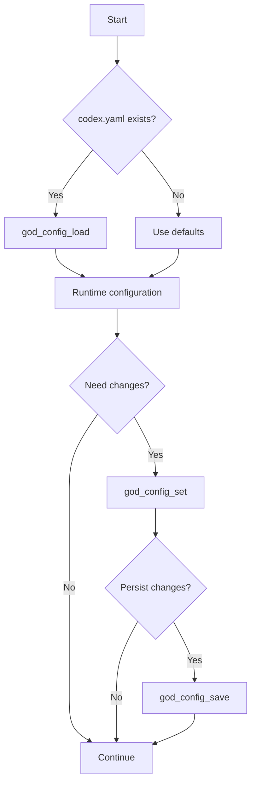

# Configuration Tools

Tools for managing RUBIX configuration.

## Tool Reference

| Tool | Purpose |
|------|---------|
| [god_config_get](#god_config_get) | Get configuration |
| [god_config_set](#god_config_set) | Update configuration |
| [god_config_load](#god_config_load) | Load from file |
| [god_config_save](#god_config_save) | Save to file |
| [god_config_reset](#god_config_reset) | Reset to defaults |

---

## god_config_get

Get current RUBIX configuration.

### Parameters

| Parameter | Type | Required | Description |
|-----------|------|----------|-------------|
| `section` | enum | No | Configuration section (default: all) |

### Sections

| Section | Description |
|---------|-------------|
| `escalation` | Escalation behavior settings |
| `workMode` | Notification and deep work settings |
| `playwright` | Browser automation settings |
| `review` | Code review settings |
| `notifications` | Notification channel settings |
| `memory` | Memory retention settings |
| `all` | Complete configuration |

### Response

```json
{
  "success": true,
  "config": {
    "escalation": {
      "maxAttemptsBeforeEscalate": 3,
      "autonomousDecisions": ["minor_versions", "formatting"],
      "requireApproval": ["database_changes", "api_breaking"]
    },
    "workMode": {
      "deepWorkDefault": true,
      "notifyOnComplete": true,
      "notifyOnBlocked": true,
      "notifyOnProgress": false,
      "batchDecisions": false
    },
    "playwright": {
      "defaultMode": "headless",
      "timeout": 30000,
      "screenshotOnFailure": true,
      "captureConsole": true
    },
    "review": {
      "autoReview": true,
      "securityScan": true,
      "requireHumanReview": ["auth", "payment"],
      "autoApproveIf": ["tests_pass", "no_security_issues"]
    },
    "notifications": {
      "console": true,
      "slack": null,
      "discord": null
    },
    "memory": {
      "storeSuccesses": true,
      "storeFailures": true,
      "pruneAfterDays": 90
    }
  }
}
```

### Example

```typescript
// Get all configuration
const config = await mcp__rubix__god_config_get({});

// Get specific section
const escalation = await mcp__rubix__god_config_get({
  section: "escalation"
});
```

---

## god_config_set

Update RUBIX configuration.

### Parameters

| Parameter | Type | Required | Description |
|-----------|------|----------|-------------|
| `escalation` | object | No | Escalation settings |
| `workMode` | object | No | Work mode settings |
| `playwright` | object | No | Playwright settings |
| `review` | object | No | Review settings |
| `notifications` | object | No | Notification settings |
| `memory` | object | No | Memory settings |

### Escalation Options

| Option | Type | Description |
|--------|------|-------------|
| `maxAttemptsBeforeEscalate` | number | Max attempts (1-10) |
| `autonomousDecisions` | string[] | Decision types RUBIX can make |
| `requireApproval` | string[] | Decision types requiring approval |

### Work Mode Options

| Option | Type | Description |
|--------|------|-------------|
| `deepWorkDefault` | boolean | Start in deep work mode |
| `notifyOnComplete` | boolean | Notify on task completion |
| `notifyOnBlocked` | boolean | Notify when blocked |
| `notifyOnProgress` | boolean | Notify on progress |
| `batchDecisions` | boolean | Batch decisions |

### Playwright Options

| Option | Type | Description |
|--------|------|-------------|
| `defaultMode` | enum | headless or visible |
| `timeout` | number | Request timeout (ms) |
| `screenshotOnFailure` | boolean | Screenshot on failure |
| `captureConsole` | boolean | Capture console logs |

### Review Options

| Option | Type | Description |
|--------|------|-------------|
| `autoReview` | boolean | Auto-review changes |
| `securityScan` | boolean | Run security scan |
| `requireHumanReview` | string[] | Patterns requiring review |
| `autoApproveIf` | string[] | Auto-approve conditions |

### Memory Options

| Option | Type | Description |
|--------|------|-------------|
| `storeSuccesses` | boolean | Store successful patterns |
| `storeFailures` | boolean | Store failure patterns |
| `pruneAfterDays` | number | Days before pruning |

### Response

```json
{
  "success": true,
  "updated": ["escalation", "workMode"],
  "message": "Configuration updated. Use god_config_save to persist."
}
```

### Example

```typescript
// Update escalation settings
await mcp__rubix__god_config_set({
  escalation: {
    maxAttemptsBeforeEscalate: 5
  }
});

// Update multiple sections
await mcp__rubix__god_config_set({
  workMode: {
    deepWorkDefault: true,
    notifyOnProgress: false
  },
  playwright: {
    timeout: 60000
  }
});
```

---

## god_config_load

Load configuration from a YAML file.

### Parameters

| Parameter | Type | Required | Description |
|-----------|------|----------|-------------|
| `path` | string | No | Path to codex.yaml |

### File Search Order

1. Specified path (if provided)
2. `codex.yaml` in current directory
3. `codex.yml`
4. `.codex.yaml`
5. `.codex.yml`
6. Parent directories (up to 3 levels)

### Response

```json
{
  "success": true,
  "loadedFrom": "D:/my-project/codex.yaml",
  "sections": ["escalation", "workMode", "review"]
}
```

### Example

```typescript
// Auto-find and load
await mcp__rubix__god_config_load({});

// Load from specific path
await mcp__rubix__god_config_load({
  path: "D:/configs/codex.yaml"
});
```

### Example codex.yaml

```yaml
# RUBIX Configuration
escalation:
  maxAttemptsBeforeEscalate: 3
  autonomousDecisions:
    - dependency_minor_versions
    - code_formatting
    - variable_naming
  requireApproval:
    - database_schema_changes
    - api_breaking_changes
    - new_dependencies

workMode:
  deepWorkDefault: true
  notifyOnComplete: true
  notifyOnBlocked: true
  notifyOnProgress: false

playwright:
  defaultMode: headless
  timeout: 30000
  screenshotOnFailure: true

review:
  autoReview: true
  securityScan: true
  requireHumanReview:
    - src/auth/**
    - src/payment/**

memory:
  storeSuccesses: true
  storeFailures: true
  pruneAfterDays: 90
```

---

## god_config_save

Save current configuration to a YAML file.

### Parameters

| Parameter | Type | Required | Description |
|-----------|------|----------|-------------|
| `path` | string | No | Path to save (default: original load path) |

### Response

```json
{
  "success": true,
  "savedTo": "D:/my-project/codex.yaml",
  "message": "Configuration saved with comments"
}
```

### Example

```typescript
// Save to original location
await mcp__rubix__god_config_save({});

// Save to new location
await mcp__rubix__god_config_save({
  path: "D:/backup/codex.yaml"
});
```

---

## god_config_reset

Reset configuration to default values.

### Parameters

None.

### Default Values

| Setting | Default |
|---------|---------|
| `escalation.maxAttemptsBeforeEscalate` | 3 |
| `workMode.deepWorkDefault` | true |
| `playwright.defaultMode` | headless |
| `playwright.timeout` | 30000 |
| `review.autoReview` | true |
| `notifications.console` | true |
| `memory.pruneAfterDays` | 90 |

### Response

```json
{
  "success": true,
  "message": "Configuration reset to defaults. Use god_config_save to persist."
}
```

### Example

```typescript
// Reset and save
await mcp__rubix__god_config_reset();
await mcp__rubix__god_config_save({});
```

---

## Configuration Workflow



---

## Environment Variable Overrides

Configuration can be overridden via environment variables:

```bash
# Escalation
RUBIX_MAX_ATTEMPTS=5

# Work mode
RUBIX_DEEP_WORK_DEFAULT=true

# Playwright
RUBIX_PLAYWRIGHT_MODE=headless
RUBIX_PLAYWRIGHT_TIMEOUT=60000

# Review
RUBIX_AUTO_REVIEW=true
RUBIX_SECURITY_SCAN=true

# Memory
RUBIX_MEMORY_PRUNE_DAYS=90
```

Priority: Environment variables > codex.yaml > defaults

---

## Complete Example

```typescript
// 1. Load configuration
await mcp__rubix__god_config_load({});

// 2. Check current settings
const config = await mcp__rubix__god_config_get({ section: "all" });
console.log('Current config:', config);

// 3. Update specific settings
await mcp__rubix__god_config_set({
  escalation: {
    maxAttemptsBeforeEscalate: 5
  },
  workMode: {
    notifyOnProgress: false
  }
});

// 4. Save changes
await mcp__rubix__god_config_save({});

// 5. Verify
const updated = await mcp__rubix__god_config_get({ section: "escalation" });
console.log('Updated:', updated.config.escalation.maxAttemptsBeforeEscalate);
```

## Next Steps

- [CODEX Tools](codex-tools.md) - Task execution
- [Notification Tools](notification-tools.md) - Notifications
- [Tools Overview](index.md) - All tools
