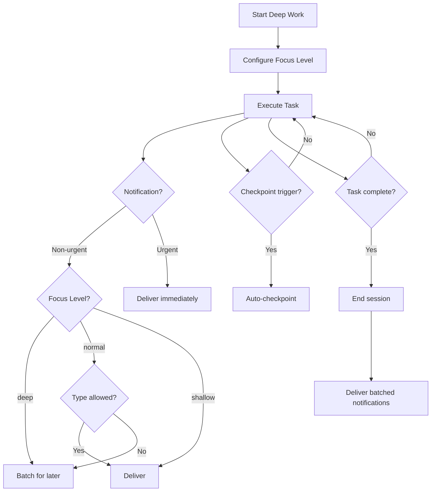

# Deep Work Tools

Tools for managing focused work sessions with smart notification batching.

## Tool Reference

| Tool | Purpose |
|------|---------|
| [god_deepwork_start](#god_deepwork_start) | Start session |
| [god_deepwork_pause](#god_deepwork_pause) | Pause session |
| [god_deepwork_resume](#god_deepwork_resume) | Resume session |
| [god_deepwork_status](#god_deepwork_status) | Get status |
| [god_deepwork_log](#god_deepwork_log) | Get work log |
| [god_deepwork_checkpoint](#god_deepwork_checkpoint) | Create checkpoint |

---

## god_deepwork_start

Start a deep work session for focused task execution.

### Parameters

| Parameter | Type | Required | Description |
|-----------|------|----------|-------------|
| `focusLevel` | enum | No | Focus level (default: normal) |
| `taskId` | string | No | Task ID to associate |
| `batchNonUrgent` | boolean | No | Batch non-urgent notifications |
| `allowUrgent` | boolean | No | Allow urgent notifications |
| `allowComplete` | boolean | No | Allow completion notifications |
| `allowBlocked` | boolean | No | Allow blocked notifications |
| `allowProgress` | boolean | No | Allow progress notifications |

### Focus Levels

| Level | Description | Notifications |
|-------|-------------|---------------|
| `shallow` | Light focus | All enabled |
| `normal` | Standard focus | Batch non-urgent, allow blockers/completions |
| `deep` | Maximum focus | Only critical/urgent + completions |

### Response

```json
{
  "success": true,
  "sessionId": "dw_abc123...",
  "focusLevel": "normal",
  "startedAt": "2024-01-15T10:00:00Z",
  "settings": {
    "batchNonUrgent": true,
    "allowUrgent": true,
    "allowComplete": true,
    "allowBlocked": true,
    "allowProgress": false
  }
}
```

### Example

```typescript
// Start normal focus session
await mcp__rubix__god_deepwork_start({
  focusLevel: "normal",
  taskId: "task_abc123"
});

// Start deep focus session (minimal interruptions)
await mcp__rubix__god_deepwork_start({
  focusLevel: "deep",
  batchNonUrgent: true,
  allowProgress: false
});
```

---

## god_deepwork_pause

Pause the current deep work session.

### Parameters

None.

### Response

```json
{
  "success": true,
  "sessionId": "dw_abc123...",
  "status": "paused",
  "activeTime": 1800000,
  "pausedAt": "2024-01-15T10:30:00Z"
}
```

### Example

```typescript
// Pause for a break
await mcp__rubix__god_deepwork_pause();

// Later, resume
await mcp__rubix__god_deepwork_resume();
```

---

## god_deepwork_resume

Resume a paused deep work session.

### Parameters

None.

### Response

```json
{
  "success": true,
  "sessionId": "dw_abc123...",
  "status": "active",
  "resumedAt": "2024-01-15T10:45:00Z",
  "totalActiveTime": 1800000
}
```

---

## god_deepwork_status

Get current deep work session status.

### Parameters

None.

### Response

```json
{
  "success": true,
  "session": {
    "id": "dw_abc123...",
    "status": "active",
    "focusLevel": "normal",
    "startedAt": "2024-01-15T10:00:00Z",
    "activeTime": 3600000
  },
  "task": {
    "id": "task_xyz789",
    "description": "Implement authentication",
    "subtasks": {
      "completed": 3,
      "total": 5
    }
  },
  "pendingDecisions": [],
  "pendingEscalations": [],
  "batchedNotifications": 5,
  "checkpoints": [
    {
      "id": "chk_1",
      "summary": "Completed design phase",
      "timestamp": "2024-01-15T10:30:00Z"
    }
  ],
  "recentActivity": [
    {
      "type": "subtask_completed",
      "description": "Created auth controller",
      "timestamp": "2024-01-15T10:45:00Z"
    }
  ]
}
```

### Example

```typescript
const status = await mcp__rubix__god_deepwork_status();

if (status.session?.status === "active") {
  console.log(`Focus level: ${status.session.focusLevel}`);
  console.log(`Active time: ${status.session.activeTime / 60000} minutes`);
  console.log(`Progress: ${status.task?.subtasks.completed}/${status.task?.subtasks.total}`);
}
```

---

## god_deepwork_log

Get the work log from the current or historical session.

### Parameters

| Parameter | Type | Required | Description |
|-----------|------|----------|-------------|
| `sessionId` | string | No | Session ID (default: current) |
| `limit` | number | No | Max entries to return |

### Response

```json
{
  "success": true,
  "sessionId": "dw_abc123...",
  "entries": [
    {
      "timestamp": "2024-01-15T10:00:00Z",
      "type": "session_started",
      "details": "Deep work session started with normal focus"
    },
    {
      "timestamp": "2024-01-15T10:05:00Z",
      "type": "task_started",
      "details": "Started: Implement authentication"
    },
    {
      "timestamp": "2024-01-15T10:15:00Z",
      "type": "subtask_completed",
      "details": "Completed: Design authentication flow"
    },
    {
      "timestamp": "2024-01-15T10:30:00Z",
      "type": "checkpoint",
      "details": "Checkpoint: Completed design phase"
    }
  ],
  "total": 25
}
```

### Log Entry Types

| Type | Description |
|------|-------------|
| `session_started` | Session began |
| `session_paused` | Session paused |
| `session_resumed` | Session resumed |
| `task_started` | Task execution started |
| `subtask_started` | Subtask began |
| `subtask_completed` | Subtask finished |
| `subtask_failed` | Subtask failed |
| `checkpoint` | Manual checkpoint |
| `decision_needed` | Decision requested |
| `decision_made` | Decision provided |
| `escalation_sent` | Escalation triggered |
| `escalation_resolved` | Escalation answered |

---

## god_deepwork_checkpoint

Create a manual checkpoint in the current session.

### Parameters

| Parameter | Type | Required | Description |
|-----------|------|----------|-------------|
| `summary` | string | Yes | Checkpoint summary/description |

### Response

```json
{
  "success": true,
  "checkpointId": "chk_xyz789...",
  "summary": "Completed authentication controller",
  "timestamp": "2024-01-15T11:00:00Z",
  "sessionActiveTime": 3600000
}
```

### Example

```typescript
// Create checkpoint at milestone
await mcp__rubix__god_deepwork_checkpoint({
  summary: "Completed authentication controller implementation"
});

// Create checkpoint before risky operation
await mcp__rubix__god_deepwork_checkpoint({
  summary: "About to refactor database layer"
});
```

### Auto-Checkpoints

Checkpoints are also created automatically:
- After task decomposition
- Every 3 completed subtasks
- On integration subtasks

---

## Deep Work Flow



---

## Focus Level Comparison

| Feature | Shallow | Normal | Deep |
|---------|---------|--------|------|
| Progress notifications | ✅ | ❌ | ❌ |
| Info notifications | ✅ | Batched | ❌ |
| Decision notifications | ✅ | ✅ | ✅ |
| Blocked notifications | ✅ | ✅ | ✅ |
| Complete notifications | ✅ | ✅ | ✅ |
| Error notifications | ✅ | ✅ | ✅ |

---

## Session Recovery

Checkpoints enable crash recovery:

```typescript
// After crash, check for recoverable session
const status = await mcp__rubix__god_deepwork_status();

if (status.checkpoints?.length > 0) {
  const lastCheckpoint = status.checkpoints[status.checkpoints.length - 1];
  console.log(`Can resume from: ${lastCheckpoint.summary}`);
}
```

---

## Complete Workflow Example

```typescript
// 1. Start deep work session
await mcp__rubix__god_deepwork_start({
  focusLevel: "normal",
  taskId: "task_auth_impl"
});

// 2. Submit task (session auto-associates)
await mcp__rubix__god_codex_do({
  description: "Implement JWT authentication",
  codebase: "D:/my-project"
});

// 3. Monitor progress
let status;
do {
  await delay(30000);  // Check every 30 seconds
  status = await mcp__rubix__god_deepwork_status();

  console.log(`Progress: ${status.task?.subtasks.completed}/${status.task?.subtasks.total}`);

  // Handle any pending decisions
  if (status.pendingDecisions.length > 0) {
    // Answer decisions...
  }
} while (status.session?.status === "active");

// 4. Get work log
const log = await mcp__rubix__god_deepwork_log({});
console.log(`Completed ${log.entries.length} activities`);

// 5. Session ends automatically on task completion
```

---

## Integration with CODEX

Deep work sessions integrate automatically with CODEX task execution:

- Session starts automatically with `god_codex_do`
- Progress tracked through subtask completion
- Checkpoints created at milestones
- Notifications batched according to focus level

```typescript
// Explicit session with custom settings
await mcp__rubix__god_deepwork_start({
  focusLevel: "deep",
  allowProgress: false
});

// Then submit task
await mcp__rubix__god_codex_do({
  description: "...",
  codebase: "..."
});
```

## Next Steps

- [CODEX Tools](codex-tools.md) - Task execution
- [Notification Tools](notification-tools.md) - Notifications
- [Config Tools](config-tools.md) - Configuration
