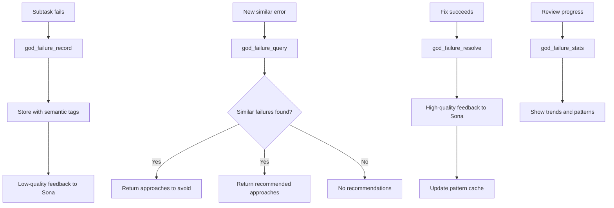

# Failure Learning Tools

Tools for recording, querying, and learning from failures.

## Tool Reference

| Tool | Purpose |
|------|---------|
| [god_failure_record](#god_failure_record) | Record failure |
| [god_failure_query](#god_failure_query) | Query similar |
| [god_failure_resolve](#god_failure_resolve) | Mark resolved |
| [god_failure_stats](#god_failure_stats) | Get statistics |

---

## god_failure_record

Record a failure in RUBIX failure memory.

### Parameters

| Parameter | Type | Required | Description |
|-----------|------|----------|-------------|
| `taskId` | string | Yes | Task ID |
| `subtaskId` | string | Yes | Subtask ID |
| `attemptNumber` | number | Yes | Attempt number |
| `approach` | string | Yes | Approach that was tried |
| `error` | string | Yes | Error message |
| `errorType` | enum | Yes | Error type classification |
| `context` | string | Yes | Failure context |
| `subtaskType` | string | Yes | Subtask type |
| `stackTrace` | string | No | Stack trace |
| `consoleErrors` | string[] | No | Console errors |
| `screenshot` | string | No | Screenshot path |

### Error Types

| Type | Description |
|------|-------------|
| `syntax` | Syntax errors |
| `type` | Type errors |
| `runtime` | Runtime errors |
| `test` | Test failures |
| `integration` | Integration failures |
| `timeout` | Timeout errors |
| `unknown` | Unknown errors |

### Response

```json
{
  "success": true,
  "failureId": "fail_abc123...",
  "errorType": "type",
  "tags": ["failure", "codex", "error:type", "subtask:code_gen"],
  "storedAt": "2024-01-15T10:00:00Z"
}
```

### Example

```typescript
await mcp__rubix__god_failure_record({
  taskId: "task_xyz789",
  subtaskId: "sub_abc123",
  attemptNumber: 2,
  approach: "Used async/await pattern for API call",
  error: "TypeError: Cannot read property 'data' of undefined",
  errorType: "type",
  context: "Fetching user profile from REST API",
  subtaskType: "code_gen",
  stackTrace: "at fetchProfile (profile.ts:42)\n  at async main (index.ts:15)",
  consoleErrors: ["Failed to load resource: 404"]
});
```

### Auto-Learning

When a failure is recorded:
1. Entry stored with semantic tags
2. Low-quality feedback sent to Sona learning
3. Pattern cache updated for future avoidance

---

## god_failure_query

Query for similar past failures.

### Parameters

| Parameter | Type | Required | Description |
|-----------|------|----------|-------------|
| `error` | string | Yes | Error message to find similar failures |
| `context` | string | No | Context to improve matching |
| `topK` | number | No | Maximum results (default: 10) |
| `minScore` | number | No | Minimum similarity score (default: 0.5) |

### Response

```json
{
  "success": true,
  "query": "TypeError: Cannot read property...",
  "similarFailures": [
    {
      "id": "fail_abc123",
      "error": "TypeError: Cannot read property 'id' of undefined",
      "approach": "Direct property access without null check",
      "resolution": "Added optional chaining operator",
      "resolved": true,
      "similarity": 0.92,
      "timestamp": "2024-01-10T15:00:00Z"
    }
  ],
  "approachesToAvoid": [
    "Direct property access without null check",
    "Assuming API always returns data"
  ],
  "recommendedApproaches": [
    "Use optional chaining (?.) for property access",
    "Add null/undefined checks before accessing nested properties"
  ]
}
```

### Example

```typescript
// Before attempting a fix, check for similar failures
const similar = await mcp__rubix__god_failure_query({
  error: "TypeError: Cannot read property 'data' of undefined",
  context: "REST API response handling",
  topK: 5,
  minScore: 0.7
});

if (similar.similarFailures.length > 0) {
  console.log("Found similar past failures:");
  for (const failure of similar.similarFailures) {
    console.log(`- ${failure.error}`);
    if (failure.resolved) {
      console.log(`  Fixed with: ${failure.resolution}`);
    }
  }
}

// Use recommended approaches
if (similar.recommendedApproaches.length > 0) {
  console.log("Recommended approaches:", similar.recommendedApproaches);
}
```

### Use Cases

1. **Before Fixing**: Check what worked before
2. **Pattern Recognition**: Identify recurring issues
3. **Learning**: Build knowledge from past failures

---

## god_failure_resolve

Mark a failure as resolved with successful approach.

### Parameters

| Parameter | Type | Required | Description |
|-----------|------|----------|-------------|
| `failureId` | string | Yes | Failure ID to resolve |
| `approach` | string | Yes | Approach that resolved the failure |

### Response

```json
{
  "success": true,
  "failureId": "fail_abc123",
  "resolution": "Used optional chaining for safe property access",
  "resolvedAt": "2024-01-15T10:30:00Z",
  "learningUpdated": true
}
```

### Example

```typescript
// After successfully fixing an issue
await mcp__rubix__god_failure_resolve({
  failureId: "fail_abc123",
  approach: "Used optional chaining (?.) and nullish coalescing (??)"
});
```

### Effects

When a failure is resolved:
1. Resolution recorded in failure memory
2. High-quality feedback sent to Sona learning
3. Pattern cache updated with successful fix
4. Future queries will suggest this approach

---

## god_failure_stats

Get failure learning statistics.

### Parameters

None.

### Response

```json
{
  "success": true,
  "stats": {
    "totalFailures": 150,
    "resolvedFailures": 120,
    "unresolvedFailures": 30,
    "resolutionRate": 0.8,
    "uniqueErrorPatterns": 45,
    "byErrorType": {
      "type": 45,
      "runtime": 35,
      "test": 30,
      "syntax": 20,
      "integration": 15,
      "timeout": 5
    },
    "bySubtaskType": {
      "code_gen": 60,
      "test": 40,
      "refactor": 25,
      "fix": 25
    },
    "recentTrends": {
      "last24h": 5,
      "last7d": 25,
      "last30d": 80
    },
    "topRecurringErrors": [
      {
        "pattern": "TypeError: Cannot read property",
        "count": 15,
        "resolutionRate": 0.9
      },
      {
        "pattern": "Test timeout exceeded",
        "count": 8,
        "resolutionRate": 0.75
      }
    ]
  }
}
```

### Example

```typescript
const stats = await mcp__rubix__god_failure_stats();

console.log(`Total failures: ${stats.stats.totalFailures}`);
console.log(`Resolution rate: ${(stats.stats.resolutionRate * 100).toFixed(1)}%`);

// Check for concerning patterns
if (stats.stats.unresolvedFailures > 20) {
  console.warn("High number of unresolved failures!");
}

// Show top error types
console.log("Error breakdown:");
for (const [type, count] of Object.entries(stats.stats.byErrorType)) {
  console.log(`  ${type}: ${count}`);
}
```

---

## Failure Learning Flow



---

## Integration with RUBIX

Failure learning is automatic in RUBIX task execution:

```typescript
// In SelfHealer.ts
async analyzeFailure(context: FailureContext): Promise<HealingAnalysis> {
  // 1. Record the failure
  const failureId = await this.failureMemory.record({
    taskId: context.taskId,
    subtaskId: context.subtaskId,
    attemptNumber: context.attempt,
    approach: context.approach,
    error: context.error.message,
    errorType: this.classifyError(context.error),
    context: context.description,
    subtaskType: context.subtaskType
  });

  // 2. Query for similar failures
  const similar = await this.failureMemory.query({
    error: context.error.message,
    context: context.description
  });

  // 3. Generate alternative approaches
  const alternatives = this.generateAlternatives(
    context,
    similar.approachesToAvoid,
    similar.recommendedApproaches
  );

  return {
    failureId,
    canRetry: alternatives.length > 0,
    alternatives,
    recommendedApproach: alternatives[0]
  };
}

// After successful fix
async recordResolution(failureId: string, approach: string) {
  await this.failureMemory.resolve(failureId, approach);
}
```

---

## Best Practices

### Recording Failures

1. **Be Specific**: Include detailed error messages and context
2. **Include Stack Traces**: Helps identify root causes
3. **Capture Console Errors**: Useful for debugging
4. **Screenshots**: Visual evidence for UI issues

### Querying Failures

1. **Use Context**: Improves matching accuracy
2. **Adjust Threshold**: Lower `minScore` for broader matches
3. **Check Both Lists**: Avoid bad approaches, try recommended ones

### Resolving Failures

1. **Document the Fix**: Be specific about what worked
2. **Explain Why**: Future queries benefit from context
3. **Resolve Promptly**: Keeps learning system accurate

## Next Steps

- [Learning Tools](learning-tools.md) - Sona learning
- [CODEX Tools](codex-tools.md) - Task execution
- [Tools Overview](index.md) - All tools
