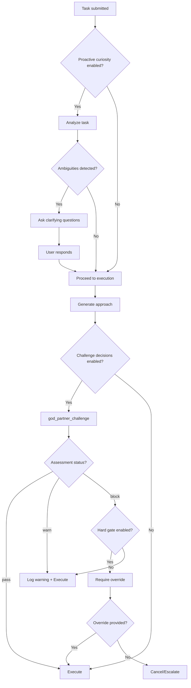
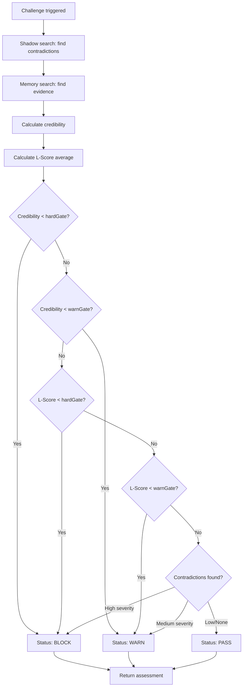

# Partner Tools

Tools for configuring the Collaborative Partner behavior.

## Tool Reference

| Tool | Purpose |
|------|---------|
| [god_partner_config](#god_partner_config) | Configure partner |
| [god_partner_challenge](#god_partner_challenge) | Trigger challenge |
| [god_partner_status](#god_partner_status) | Get status |

---

## Overview

The Collaborative Partner provides proactive assistance during task execution:

- **Proactive Curiosity**: Asks questions before executing
- **Challenge Decisions**: Uses shadow search to find contradictions
- **Confidence Gates**: L-Score thresholds for warn/block
- **Hard Gate**: Requires override for risky decisions

---

## god_partner_config

Configure the Collaborative Partner behavior.

### Parameters

| Parameter | Type | Required | Description |
|-----------|------|----------|-------------|
| `enabled` | boolean | No | Enable/disable partner |
| `behaviors` | object | No | Behavior settings |
| `thresholds` | object | No | Threshold settings |

### Behaviors Object

| Field | Type | Description |
|-------|------|-------------|
| `proactiveCuriosity` | boolean | Ask questions before executing |
| `challengeDecisions` | boolean | Use shadow search for contradictions |
| `hardGateHighRisk` | boolean | Require override for risky decisions |

### Thresholds Object

| Field | Type | Default | Description |
|-------|------|---------|-------------|
| `credibilityHardGate` | number | 0.3 | Credibility BLOCK threshold |
| `credibilityWarnGate` | number | 0.5 | Credibility WARN threshold |
| `lScoreHardGate` | number | 0.2 | L-Score BLOCK threshold |
| `lScoreWarnGate` | number | 0.5 | L-Score WARN threshold |

### Response

```json
{
  "success": true,
  "config": {
    "enabled": true,
    "behaviors": {
      "proactiveCuriosity": true,
      "challengeDecisions": true,
      "hardGateHighRisk": true
    },
    "thresholds": {
      "credibilityHardGate": 0.3,
      "credibilityWarnGate": 0.5,
      "lScoreHardGate": 0.2,
      "lScoreWarnGate": 0.5
    }
  }
}
```

### Examples

```typescript
// Enable all behaviors
await mcp__rubix__god_partner_config({
  enabled: true,
  behaviors: {
    proactiveCuriosity: true,
    challengeDecisions: true,
    hardGateHighRisk: true
  }
});

// Adjust thresholds for stricter checking
await mcp__rubix__god_partner_config({
  thresholds: {
    credibilityHardGate: 0.4,
    credibilityWarnGate: 0.6,
    lScoreHardGate: 0.3,
    lScoreWarnGate: 0.6
  }
});

// Disable challenge mode
await mcp__rubix__god_partner_config({
  behaviors: {
    challengeDecisions: false
  }
});
```

---

## god_partner_challenge

Manually trigger a challenge assessment on an approach.

### Parameters

| Parameter | Type | Required | Description |
|-----------|------|----------|-------------|
| `approach` | string | Yes | The approach/plan to assess |
| `taskDescription` | string | No | Optional task description |
| `subtaskDescription` | string | No | Optional subtask description |

### Response

```json
{
  "success": true,
  "challengeId": "chal_abc123...",
  "assessment": {
    "credibility": 0.65,
    "lScore": 0.72,
    "status": "warn",
    "concerns": [
      {
        "type": "contradiction",
        "content": "Previous similar approach failed with timeout errors",
        "severity": "medium",
        "source": "failure_memory"
      },
      {
        "type": "low_confidence",
        "content": "Limited evidence for this pattern in codebase",
        "severity": "low",
        "source": "shadow_search"
      }
    ],
    "supportingEvidence": [
      {
        "content": "Similar pattern used successfully in auth module",
        "source": "memory_search",
        "similarity": 0.78
      }
    ],
    "recommendation": "Proceed with caution - consider alternative approaches"
  }
}
```

### Challenge Statuses

| Status | Description |
|--------|-------------|
| `pass` | No concerns, safe to proceed |
| `warn` | Minor concerns, proceed with caution |
| `block` | Major concerns, requires override |

### Examples

```typescript
// Challenge an approach before implementation
const challenge = await mcp__rubix__god_partner_challenge({
  approach: "Use localStorage for storing authentication tokens",
  taskDescription: "Implement user authentication",
  subtaskDescription: "Token storage mechanism"
});

if (challenge.assessment.status === "block") {
  console.error("Approach blocked!");
  console.log("Concerns:");
  for (const concern of challenge.assessment.concerns) {
    console.log(`- [${concern.severity}] ${concern.content}`);
  }
}

if (challenge.assessment.status === "warn") {
  console.warn("Proceed with caution");
  console.log("Recommendation:", challenge.assessment.recommendation);
}
```

---

## god_partner_status

Get current Collaborative Partner status and configuration.

### Parameters

None.

### Response

```json
{
  "success": true,
  "partner": {
    "enabled": true,
    "behaviors": {
      "proactiveCuriosity": true,
      "challengeDecisions": true,
      "hardGateHighRisk": true
    },
    "thresholds": {
      "credibilityHardGate": 0.3,
      "credibilityWarnGate": 0.5,
      "lScoreHardGate": 0.2,
      "lScoreWarnGate": 0.5
    }
  },
  "containment": {
    "enabled": true,
    "projectRoot": "D:/my-project",
    "defaultPermission": "deny"
  },
  "statistics": {
    "challengesPerformed": 45,
    "blocksTriggered": 3,
    "warningsIssued": 12,
    "questionsAsked": 28
  }
}
```

### Example

```typescript
const status = await mcp__rubix__god_partner_status();

console.log(`Partner enabled: ${status.partner.enabled}`);
console.log(`Challenges performed: ${status.statistics.challengesPerformed}`);
console.log(`Blocks triggered: ${status.statistics.blocksTriggered}`);

// Check threshold settings
const { thresholds } = status.partner;
console.log(`Credibility hard gate: ${thresholds.credibilityHardGate}`);
```

---

## Partner Behavior Flow



---

## Challenge Assessment Logic



---

## Integration with CODEX

The Collaborative Partner integrates with task execution:

```typescript
// In TaskExecutor.ts
async executeSubtask(subtask: Subtask): Promise<SubtaskResult> {
  // Challenge the approach if enabled
  if (this.partner.config.behaviors.challengeDecisions) {
    const challenge = await this.partner.challenge({
      approach: subtask.approach,
      taskDescription: this.currentTask.description,
      subtaskDescription: subtask.description
    });

    if (challenge.status === "block") {
      // Require override or escalate
      if (this.partner.config.behaviors.hardGateHighRisk) {
        const override = await this.requestOverride(challenge);
        if (!override.approved) {
          return this.escalate(subtask, challenge);
        }
      }
    }

    if (challenge.status === "warn") {
      this.logWarning(challenge);
    }
  }

  // Proceed with execution
  return this.codeGenerator.generate(subtask);
}
```

---

## Best Practices

### Configuration

1. **Start Conservative**: Begin with strict thresholds
2. **Adjust Over Time**: Loosen based on false positive rate
3. **Enable All Behaviors**: Full protection from mistakes

### Challenges

1. **Include Context**: More context = better assessment
2. **Review Warnings**: Don't ignore warn status
3. **Document Overrides**: Log why you proceeded despite block

### Thresholds

| Use Case | Credibility Hard | Credibility Warn | L-Score Hard | L-Score Warn |
|----------|------------------|------------------|--------------|--------------|
| Production | 0.4 | 0.6 | 0.3 | 0.6 |
| Development | 0.3 | 0.5 | 0.2 | 0.5 |
| Experimental | 0.2 | 0.4 | 0.1 | 0.4 |

---

## Complete Example

```typescript
// 1. Configure partner for production
await mcp__rubix__god_partner_config({
  enabled: true,
  behaviors: {
    proactiveCuriosity: true,
    challengeDecisions: true,
    hardGateHighRisk: true
  },
  thresholds: {
    credibilityHardGate: 0.4,
    credibilityWarnGate: 0.6,
    lScoreHardGate: 0.3,
    lScoreWarnGate: 0.6
  }
});

// 2. Check status
const status = await mcp__rubix__god_partner_status();
console.log("Partner configured:", status.partner.enabled);

// 3. Manually test an approach
const challenge = await mcp__rubix__god_partner_challenge({
  approach: "Deploy database changes without migration script",
  taskDescription: "Update user schema"
});

console.log(`Assessment: ${challenge.assessment.status}`);
console.log(`Credibility: ${challenge.assessment.credibility}`);

if (challenge.assessment.concerns.length > 0) {
  console.log("\nConcerns:");
  for (const concern of challenge.assessment.concerns) {
    console.log(`  [${concern.severity}] ${concern.content}`);
  }
}

// 4. Based on assessment, decide to proceed or not
if (challenge.assessment.status === "pass") {
  console.log("Safe to proceed!");
} else {
  console.log("Consider alternative approaches");
}
```

## Next Steps

- [Curiosity Tools](curiosity-tools.md) - Proactive curiosity
- [Containment Tools](containment-tools.md) - Path permissions
- [CODEX Tools](codex-tools.md) - Task execution
